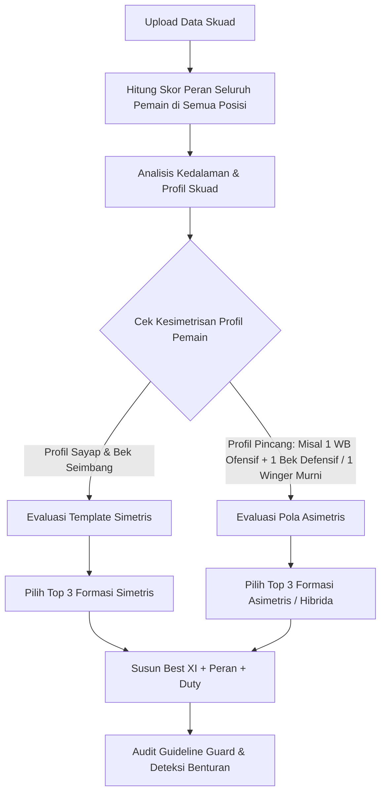
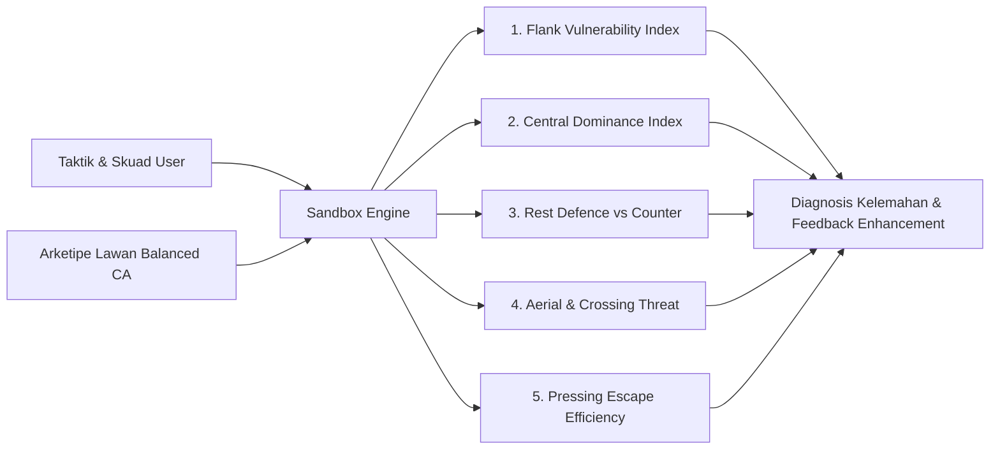

# 🧠 FM24 Tactical & Squad Engine Specification
**Dokumentasi Logika Dasar, Formula Atribut, dan Matriks Validasi Taktik**

Dokumen ini adalah acuan arsitektur logika (*core engine*) untuk tools Football Manager 2024. Semua aturan perhitungan, kamus role, deteksi benturan (*clashes*), dan validasi keseimbangan formasi didefinisikan di sini.

---

## 📌 DAFTAR ISI
1. [Model Data & Formula Perhitungan Role Suitability](#1-model-data--formula-perhitungan-role-suitability)
2. [Kamus Lengkap Role & Profil Bobot Atribut FM24 (All Positions)](#2-kamus-lengkap-role--profil-bobot-atribut-fm24-all-positions)
3. [Matriks Benturan Taktik (Guideline Guard)](#3-matriks-benturan-taktik-guideline-guard)
   - 3.1 [Tabrakan Ruang & Koridor (Space & Zone Clashes)](#31-tabrakan-ruang--koridor-space--zone-clashes)
   - 3.2 [Distribusi & Keseimbangan Duty (Duty Balance & Defensive Cover Reasoning)](#32-distribusi--keseimbangan-duty-duty-balance--defensive-cover-reasoning)
   - 3.3 [Kapasitas Atribut Pemain vs Role (Capacity Warnings - Exhaustive Roles)](#33-kapasitas-atribut-pemain-vs-role-capacity-warnings---exhaustive-roles)
   - 3.4 [Benturan Instruksi Tim vs Role (Comprehensive Instruction Conflicts)](#34-benturan-instruksi-tim-vs-role-comprehensive-instruction-conflicts)
   - 3.5 [Mesin Instruksi Pemain (Player Instruction Engine: Hardcoded PIs, Konflik PI vs TI, & Tailored PI Enhancer)](#35-mesin-instruksi-pemain-player-instruction-engine-hardcoded-pis-konflik-pi-vs-ti--tailored-pi-enhancer)
4. [Logika Rekomendasi Formasi Otomatis (Formation Recommender & Asymmetric Engineering)](#4-logika-rekomendasi-formasi-otomatis-formation-recommender)
5. [Algoritma Sandbox Simulation & Tactical Stress-Testing (Adu Formasi & Vulnerability Analysis)](#5-algoritma-sandbox-simulation--tactical-stress-testing-adu-formasi--vulnerability-analysis)
6. [Skema Data TypeScript Lengkap (Data Structures)](#6-skema-data-typescript-lengkap-data-structures)

---

## 1. Model Data & Formula Perhitungan Role Suitability

Setiap pemain di FM memiliki atribut bernilai **1 – 20** dan tingkat kemahiran posisi (*Positional Familiarity*).

### A. Bobot Atribut Role
Dalam Football Manager, atribut untuk setiap role dibagi menjadi dua kategori:
* **Key Attributes ($W_{key} = 3$ atau bobot x3):** Atribut esensial mutlak yang mendefinisikan keberhasilan role.
* **Desirable Attributes ($W_{des} = 1$ atau bobot x1):** Atribut pendukung yang membuat peran berjalan optimal.

### B. Rumus Skor Kecocokan Dasar (Raw Role Score)
$$\text{RawScore} = \frac{\sum (A_{key} \times 3) + \sum (A_{des} \times 1)}{\text{MaxScore}}$$

*Di mana $\text{MaxScore} = (\text{Jumlah Key} \times 3 \times 20) + (\text{Jumlah Desirable} \times 1 \times 20)$.*

### C. Pengali Kemahiran Posisi (Positional Familiarity Multiplier)
Jika pemain dimainkan di luar posisi aslinya, skor kecocokan role dikalikan dengan faktor posisi:
* **Natural:** $1.00$ (100%)
* **Accomplished:** $0.85$ (85%)
* **Unconvincing:** $0.65$ (65%)
* **Awkward / Ineffective:** $0.40$ (40%)

$$\text{FinalRoleSuitability} = \text{RawScore} \times \text{FamiliarityMultiplier} \times 100\%$$

---

## 2. Kamus Lengkap Role & Profil Bobot Atribut FM24 (All Positions)

Bagian ini memuat seluruh role resmi yang ada di Football Manager 2024 tanpa terkecuali, dikelompokkan berdasarkan posisi taktik, beserta variasi *duty*, atribut kunci (*Key* - bobot x3), atribut pendukung (*Desirable* - bobot x1), dan perilaku taktisnya di *Match Engine*.

---

### 🧤 1. GOALKEEPER (GK)

#### 1.1 Goalkeeper (GK)
* **Duty:** `Defend`
* **Perilaku:** Kiper tradisional yang fokus pada pencegahan kebobolan mendasar; tetap berada di garis gawang dan jarang keluar jauh untuk menyapu bola.
* **Key Attributes:** Reflexes, Handling, Aerial Reach, Positioning, Communication.
* **Desirable Attributes:** One on Ones, Command of Area, Kicking, Throwing, Agility, Concentration, Decisions.

#### 1.2 Sweeper Keeper (SK)
* **Duty:** `Defend`, `Support`, `Attack`
* **Perilaku:** Aktif maju menyapu bola terobosan di belakang garis pertahanan tinggi (*high line*), berpartisipasi aktif dalam sirkulasi *build-up* dari bawah. Pada duty *Attack*, sering menggiring bola keluar dari kotak penalti seperti Ederson / Neuer.
* **Key Attributes:**
  * *Defend:* Reflexes, Rushing Out, Anticipation, Positioning, Composure, Kicking, One on Ones.
  * *Support/Attack:* Reflexes, Rushing Out, Anticipation, Composure, Kicking, One on Ones, Passing, First Touch.
* **Desirable Attributes:** Vision, Pace, Acceleration, Agility, Decisions, Concentration, Command of Area, Aerial Reach.

---

### 🛡️ 2. CENTRAL DEFENDER (DC)

#### 2.1 Central Defender (CD)
* **Duty:** `Defend`, `Stopper`, `Cover`
* **Perilaku:** Bek tengah konvensional; memenangkan duel udara, merebut bola, dan mengamankan zona berbahaya tanpa mengambil risiko operan rumit.
  * *Stopper:* Maju memotong bola sebelum lawan berbalik badan.
  * *Cover:* Sedikit mundur untuk menyapu bola terobosan lawan.
* **Key Attributes:** Tackling, Marking, Heading, Positioning, Jumping Reach, Strength.
* **Desirable Attributes:** Anticipation, Bravery, Concentration, Decisions, Pace, Acceleration, Composure.

#### 2.2 Ball Playing Defender (BPD)
* **Duty:** `Defend`, `Stopper`, `Cover`
* **Perilaku:** Menjadi inisiator serangan dari lini belakang; berani menahan bola di bawah tekanan dan melepaskan umpan terobosan panjang/diagonal ke sayap atau striker.
* **Key Attributes:** Tackling, Marking, Heading, Positioning, Passing, Composure, Decisions, Jumping Reach, Strength.
* **Desirable Attributes:** Vision, Technique, First Touch, Anticipation, Bravery, Concentration, Pace.

#### 2.3 No-Nonsense Centre-Back (NCB)
* **Duty:** `Defend`, `Stopper`, `Cover`
* **Perilaku:** Pendekatan *safety first*; tidak mengambil risiko sama sekali dalam memegang bola, langsung membuang bola jauh ke depan atau keluar lapangan saat ditekan.
* **Key Attributes:** Tackling, Marking, Heading, Positioning, Jumping Reach, Strength, Bravery.
* **Desirable Attributes:** Concentration, Aggression, Anticipation, Pace.

#### 2.4 Wide Centre-Back (WCB) — *(Khusus Formasi 3 Bek / 5 Bek)*
* **Duty:** `Defend`, `Support`, `Attack`
* **Perilaku:** Beroperasi di sisi kanan/kiri dalam skema 3 bek tengah. Pada duty *Support* dan *Attack*, mereka akan melebar dan overlap/underlap ke sepertiga akhir lawan seperti bek sayap kejutan.
* **Key Attributes:**
  * *Defend:* Tackling, Marking, Heading, Positioning, Decisions, Pace, Jumping Reach, Strength.
  * *Support/Attack:* Tackling, Marking, Positioning, Passing, Crossing, Dribbling, Decisions, Work Rate, Stamina, Pace, Acceleration.
* **Desirable Attributes:** Anticipation, Composure, Technique, First Touch, Vision, Bravery.

#### 2.5 Libero (LIB) — *(Bek Tengah Sentral)*
* **Duty:** `Defend`, `Support`
* **Perilaku:** Berada di tengah 3 bek tengah. Saat tim menguasai bola, ia melangkah maju ke lini gelandang bertahan/sentral (*step into midfield*) sebagai playmaker tambahan seperti John Stones / Beckenbauer.
* **Key Attributes:** Composure, Decisions, Passing, Vision, Technique, Positioning, Anticipation, Tackling, Teamwork.
* **Desirable Attributes:** First Touch, Marking, Heading, Stamina, Pace, Agility, Concentration, Jumping Reach.

---

### 🏃 3. FULL-BACKS & WING-BACKS (DR / DL & WBR / WBL)

#### 3.1 Full-Back (FB)
* **Duty:** `Defend`, `Support`, `Attack`, `Automatic`
* **Perilaku:** Bek sayap standar; menyeimbangkan tugas defensif di koridor luar dengan sesekali overlap memberikan opsi umpan silang.
* **Key Attributes:**
  * *Defend:* Tackling, Marking, Positioning, Anticipation, Concentration, Pace, Stamina.
  * *Support/Attack:* Tackling, Marking, Positioning, Crossing, Work Rate, Stamina, Pace, Acceleration.
* **Desirable Attributes:** Passing, Technique, Decisions, Teamwork, Agility, Strength.

#### 3.2 Wing-Back (WB)
* **Duty:** `Defend`, `Support`, `Attack`, `Automatic`
* **Perilaku:** Bertanggung jawab penuh atas seluruh garis tepi lapangan; aktif naik membantu serangan dan rajin turun menutup sayap.
* **Key Attributes:** Crossing, Dribbling, Tackling, Marking, Work Rate, Stamina, Pace, Acceleration, Positioning.
* **Desirable Attributes:** Passing, Technique, Decisions, Off the Ball, Anticipation, Agility.

#### 3.3 No-Nonsense Full-Back (NFB)
* **Duty:** `Defend`
* **Perilaku:** Bek sayap murni defensif; tidak pernah naik menyerang, hanya fokus menutup pergerakan winger lawan dan membuang bola.
* **Key Attributes:** Tackling, Marking, Positioning, Anticipation, Concentration, Strength, Pace.
* **Desirable Attributes:** Heading, Bravery, Decisions, Stamina.

#### 3.4 Complete Wing-Back (CWB)
* **Duty:** `Support`, `Attack`
* **Perilaku:** Bek sayap ofensif bebas; memiliki kebebasan kreatif (*flair*) untuk memotong ke tengah, melakukan dribel menusuk, atau melepaskan crossing dari byline (contoh: Marcelo / Dani Alves).
* **Key Attributes:** Crossing, Dribbling, Technique, First Touch, Passing, Work Rate, Stamina, Pace, Acceleration, Agility, Decisions, Off the Ball.
* **Desirable Attributes:** Vision, Flair, Anticipation, Tackling, Marking, Positioning, Composure.

#### 3.5 Inverted Wing-Back (IWB)
* **Duty:** `Defend`, `Support`, `Attack`
* **Perilaku:** Masuk ke area *half-space* atau pivot lini tengah saat tim memegang bola, menciptakan keunggulan jumlah (*overload*) di lini tengah (contoh: Zinchenko, Kyle Walker).
* **Key Attributes:** Passing, Decisions, Composure, Work Rate, Stamina, Positioning, Tackling, Teamwork.
* **Desirable Attributes:** Vision, Technique, First Touch, Anticipation, Pace, Acceleration, Marking.

#### 3.6 Inverted Full-Back (IFB) — *(Fitur Baru FM24 - Khusus DR/DL)*
* **Duty:** `Defend`
* **Perilaku:** Saat menyerang, bergeser ke tengah menjadi bek tengah ketiga dan membentuk pola 3 bek di belakang. Tidak pernah overlap ke depan, sangat kokoh untuk rest defence (contoh: Ben White, Josko Gvardiol, Nathan Ake).
* **Key Attributes:** Tackling, Marking, Positioning, Anticipation, Heading, Jumping Reach, Strength.
* **Desirable Attributes:** Pace, Decisions, Concentration, Passing, Bravery.

---

### ⚓ 4. DEFENSIVE MIDFIELDER (DM)

#### 4.1 Defensive Midfielder (DM)
* **Duty:** `Defend`, `Support`
* **Perilaku:** Gelandang bertahan seimbang; memproteksi lini belakang, menutup ruang antar-lini, dan mendistribusikan bola secara aman.
* **Key Attributes:** Tackling, Positioning, Anticipation, Decisions, Teamwork, Work Rate, Stamina.
* **Desirable Attributes:** Marking, Passing, Composure, Concentration, Strength, Pace.

#### 4.2 Deep Lying Playmaker (DLP - DM)
* **Duty:** `Defend`, `Support`
* **Perilaku:** Mengatur tempo pertandingan dari kedalaman (*quarterback*); meminta bola dari bek dan mendistribusikan operan presisi ke lini depan (contoh: Pirlo, Rodri).
* **Key Attributes:** Passing, Vision, Composure, Decisions, Technique, Teamwork, First Touch.
* **Desirable Attributes:** Positioning, Anticipation, Tackling, Balance, Concentration.

#### 4.3 Ball Winning Midfielder (BWM - DM)
* **Duty:** `Defend`, `Support`
* **Perilaku:** Agresif memburu pemain lawan yang memegang bola, mengganggu ritme lawan dan merebut bola secepat mungkin (contoh: Gattuso, Casemiro).
* **Key Attributes:** Tackling, Aggression, Bravery, Work Rate, Stamina, Teamwork, Anticipation, Strength.
* **Desirable Attributes:** Positioning, Marking, Decisions, Acceleration, Pace, Agility.

#### 4.4 Anchor (A)
* **Duty:** `Defend`
* **Perilaku:** Gelandang jangkar statis (*the water carrier*); tidak pernah meninggalkan posisinya di depan dua bek tengah, fokus mutlak menghentikan serangan balik dan memberikan operan pendek sederhana.
* **Key Attributes:** Positioning, Tackling, Marking, Decisions, Anticipation, Concentration, Strength.
* **Desirable Attributes:** Teamwork, Composure, Passing, Work Rate.

#### 4.5 Half Back (HB)
* **Duty:** `Defend`
* **Perilaku:** Turun di antara dua bek tengah saat *build-up*, memungkinkan kedua bek tengah melebar dan kedua bek sayap naik tinggi dengan aman.
* **Key Attributes:** Positioning, Tackling, Marking, Decisions, Anticipation, Composure, Teamwork.
* **Desirable Attributes:** Passing, Vision, Concentration, Jumping Reach, Strength.

#### 4.6 Regista (REG)
* **Duty:** `Support`
* **Perilaku:** Playmaker dinamis dan agresif dari kedalaman; tidak hanya diam mengatur tempo tetapi juga bebas bergerak mencari ruang dan mendukung serangan di sepertiga akhir.
* **Key Attributes:** Passing, Vision, Decisions, Composure, Technique, First Touch, Flair, Teamwork, Off the Ball.
* **Desirable Attributes:** Anticipation, Balance, Agility, Stamina.

#### 4.7 Roaming Playmaker (RPM - DM)
* **Duty:** `Support`
* **Perilaku:** Playmaker serba bisa yang menjelajahi seluruh area lapangan; menjemput bola dari belakang, mengalirkan ke tengah, dan menusuk ke depan. Membutuhkan fisik yang luar biasa.
* **Key Attributes:** Passing, Vision, Decisions, Composure, Technique, First Touch, Work Rate, Stamina, Off the Ball, Anticipation, Teamwork.
* **Desirable Attributes:** Acceleration, Pace, Agility, Balance, Dribbling, Tackling.

#### 4.8 Segundo Volante (VOL)
* **Duty:** `Support`, `Attack`
* **Perilaku:** Peran dinamis dalam skema dua DM (*double pivot*). Saat bertahan ia merebut bola, namun saat menyerang ia melakukan lari terlambat (*late runs*) menusuk ke kotak penalti lawan untuk mencetak gol.
* **Key Attributes:** Tackling, Work Rate, Stamina, Pace, Acceleration, Passing, Off the Ball, Decisions, Anticipation.
* **Desirable Attributes:** Finishing, Long Shots, Composure, Technique, Marking, Positioning, Strength.

---

### 🎯 5. CENTRAL MIDFIELDER (MC / CM)

#### 5.1 Central Midfielder (CM)
* **Duty:** `Defend`, `Support`, `Attack`, `Automatic`
* **Perilaku:** Gelandang sentral murni yang menjalankan fungsi bertahan, menghubungkan lini, atau masuk kotak penalti sesuai tugas (*duty*) yang dipilih.
* **Key Attributes:**
  * *Defend:* Tackling, Positioning, Decisions, Teamwork, Work Rate, Stamina, Passing.
  * *Support:* Passing, Decisions, First Touch, Technique, Teamwork, Work Rate, Stamina, Tackling.
  * *Attack:* Passing, Off the Ball, Decisions, First Touch, Technique, Work Rate, Stamina, Long Shots.
* **Desirable Attributes:** Anticipation, Composure, Vision, Finishing, Acceleration.

#### 5.2 Deep Lying Playmaker (DLP - CM)
* **Duty:** `Defend`, `Support`
* **Perilaku:** Sama seperti versi DM, tetapi beroperasi sedikit lebih maju di lini tengah sentral.
* **Key Attributes:** Passing, Vision, Composure, Decisions, Technique, Teamwork, First Touch.
* **Desirable Attributes:** Positioning, Anticipation, Tackling, Balance, Concentration.

#### 5.3 Box-to-Box Midfielder (BBM)
* **Duty:** `Support`
* **Perilaku:** Paru-paru tim (*engine room*); aktif bertahan di kotak penalti sendiri, mengalirkan bola, dan langsung lari mendukung serangan di kotak penalti lawan (contoh: Valverde, Gerrard).
* **Key Attributes:** Stamina, Work Rate, Tackling, Passing, Off the Ball, Decisions, Teamwork, Anticipation, Acceleration.
* **Desirable Attributes:** Finishing, Long Shots, Technique, First Touch, Positioning, Strength, Pace.

#### 5.4 Ball Winning Midfielder (BWM - CM)
* **Duty:** `Defend`, `Support`
* **Perilaku:** Menekan lawan secara intens di sepertiga tengah lapangan untuk memutus serangan lawan sedini mungkin.
* **Key Attributes:** Tackling, Aggression, Bravery, Work Rate, Stamina, Teamwork, Anticipation.
* **Desirable Attributes:** Positioning, Marking, Decisions, Strength, Acceleration.

#### 5.5 Advanced Playmaker (AP - CM)
* **Duty:** `Support`, `Attack`
* **Perilaku:** Beroperasi di ruang antara gelandang lawan dan pertahanan; mencari celah operan kunci (*key passes*) untuk striker dan sayap (contoh: De Bruyne, Odegaard).
* **Key Attributes:** Vision, Passing, Decisions, Composure, Technique, First Touch, Off the Ball, Teamwork.
* **Desirable Attributes:** Flair, Agility, Balance, Anticipation, Dribbling.

#### 5.6 Mezzala (MEZ)
* **Duty:** `Support`, `Attack`
* **Perilaku:** Gelandang tengah modern yang bergerak melebar ke area *half-space*; melakukan rotasi posisi dengan pemain sayap dan mengeksploitasi celah antara bek tengah dan bek sayap lawan.
* **Key Attributes:** Passing, Vision, Technique, Off the Ball, Decisions, Work Rate, Acceleration.
* **Desirable Attributes:** Dribbling, First Touch, Long Shots, Stamina, Flair, Agility, Finishing.

#### 5.7 Carrilero (CAR)
* **Duty:** `Support`
* **Perilaku:** Gelandang perayap lateral (*shuttler*); hanya bergerak ke sisi kanan/kiri di lini tengah untuk menutup celah yang ditinggalkan bek sayap atau gelandang serang, menghubungkan permainan dengan aman.
* **Key Attributes:** Tackling, Positioning, Decisions, Passing, Teamwork, Work Rate, Stamina.
* **Desirable Attributes:** Anticipation, Composure, First Touch, Marking, Technique.

---

### 🚩 6. WIDE MIDFIELDER (MR / ML)

#### 6.1 Wide Midfielder (WM)
* **Duty:** `Defend`, `Support`, `Attack`, `Automatic`
* **Perilaku:** Gelandang sayap taktis; disiplin bertahan bersama bek sayap dan memberikan distribusi bola terukur ke depan.
* **Key Attributes:** Work Rate, Teamwork, Stamina, Passing, Crossing, Decisions, Positioning, Tackling.
* **Desirable Attributes:** First Touch, Technique, Anticipation, Pace, Acceleration.

#### 6.2 Winger (W - MR/ML)
* **Duty:** `Support`, `Attack`
* **Perilaku:** Menempel garis tepi lapangan (*hugs touchline*), mengalahkan bek lawan dengan kecepatan/dribel, dan melepaskan crossing ke kotak penalti.
* **Key Attributes:** Crossing, Dribbling, Pace, Acceleration, Technique, Agility, Work Rate.
* **Desirable Attributes:** Passing, First Touch, Off the Ball, Decisions, Balance, Stamina.

#### 6.3 Defensive Winger (DW)
* **Duty:** `Defend`, `Support`
* **Perilaku:** Pemain sayap pekerja keras yang tugas utamanya menekan dan menghentikan bek sayap/winger lawan, sangat krusial dalam taktik *pressing* disiplin.
* **Key Attributes:** Work Rate, Stamina, Tackling, Teamwork, Positioning, Anticipation, Pace, Acceleration.
* **Desirable Attributes:** Crossing, Marking, Decisions, Passing, Concentration.

#### 6.4 Inverted Winger (IW - MR/ML)
* **Duty:** `Support`, `Attack`
* **Perilaku:** Bermain dengan kaki terbalik (*opposite foot*); memotong ke dalam (*half-space*) untuk membuka jalur bagi overlapping bek sayap atau melepaskan umpan terobosan.
* **Key Attributes:** Crossing, Dribbling, Passing, Technique, Decisions, Off the Ball, Acceleration, Pace, Agility.
* **Desirable Attributes:** Vision, First Touch, Long Shots, Work Rate, Stamina.

#### 6.5 Wide Playmaker (WP)
* **Duty:** `Support`, `Attack`
* **Perilaku:** Mengatur tempo dan orkestrasi serangan dari posisi sayap untuk menghindari kepadatan di lini tengah, lalu menusuk ke dalam saat build-up.
* **Key Attributes:** Passing, Vision, Decisions, Composure, Technique, First Touch, Teamwork, Off the Ball.
* **Desirable Attributes:** Anticipation, Balance, Agility, Crossing.

#### 6.6 Wide Target Forward (WTF - MR/ML)
* **Duty:** `Support`, `Attack`
* **Perilaku:** Pemain berpostur tinggi/kuat yang dipasang di sayap untuk mengeksploitasi duel udara melawan bek sayap lawan yang bertubuh lebih kecil.
* **Key Attributes:** Heading, Jumping Reach, Strength, Bravery, Balance, Off the Ball.
* **Desirable Attributes:** First Touch, Passing, Teamwork, Work Rate, Anticipation.

---

### 🎩 7. ATTACKING MIDFIELDER CENTRAL (AMC)

#### 7.1 Attacking Midfielder (AM)
* **Duty:** `Support`, `Attack`
* **Perilaku:** Pemain nomor 10 klasik; beroperasi di belakang striker, melakukan kombinasi operan pendek atau lari menusuk ke kotak penalti lawan.
* **Key Attributes:** Passing, Technique, First Touch, Decisions, Vision, Off the Ball, Anticipation.
* **Desirable Attributes:** Dribbling, Finishing, Long Shots, Composure, Acceleration, Agility.

#### 7.2 Advanced Playmaker (AP - AMC)
* **Duty:** `Support`, `Attack`
* **Perilaku:** Titik tumpu utama kreativitas tim; terus-menerus mencari ruang kosong untuk menerima bola dan melepaskan operan pembelah pertahanan (*killer balls*).
* **Key Attributes:** Vision, Passing, Decisions, Composure, Technique, First Touch, Off the Ball, Teamwork.
* **Desirable Attributes:** Flair, Agility, Anticipation, Dribbling, Balance.

#### 7.3 Shadow Striker (SS)
* **Duty:** `Attack`
* **Perilaku:** Bertindak layaknya striker kedua; aktif menekan saat bertahan dan secara agresif melakukan sprint menusuk ke kotak penalti untuk mencetak gol (contoh: Thomas Müller).
* **Key Attributes:** Finishing, Off the Ball, Acceleration, Pace, Anticipation, Composure, Decisions, Work Rate.
* **Desirable Attributes:** Passing, First Touch, Technique, Dribbling, Stamina, Agility.

#### 7.4 Enganche (ENG)
* **Duty:** `Support`
* **Perilaku:** Playmaker statis klasik Amerika Selatan; menjadi jangkar serangan tim, jarang bergerak jauh dari posisinya, tetapi mendistribusikan bola dengan visi dan sentuhan magis tanpa banyak lari.
* **Key Attributes:** Passing, Vision, Technique, First Touch, Composure, Decisions, Teamwork.
* **Desirable Attributes:** Flair, Anticipation, Balance.

#### 7.5 Trequartista (TRE - AMC)
* **Duty:** `Attack`
* **Perilaku:** Pemain nomor 10 bebas tanpa beban defensif sama sekali; berkeliaran mencari ruang, menggiring bola, dan menciptakan keajaiban individu.
* **Key Attributes:** Vision, Passing, Technique, First Touch, Flair, Dribbling, Off the Ball, Decisions, Composure, Agility.
* **Desirable Attributes:** Acceleration, Balance, Anticipation, Finishing.

---

### ⚡ 8. ATTACKING MIDFIELDER WINGS (AMR / AML)

#### 8.1 Winger (W - AMR/AML)
* **Duty:** `Support`, `Attack`
* **Perilaku:** Menyerang sisi luar pertahanan lawan dengan kecepatan tinggi dan mengirimkan umpan silang akurat dari byline.
* **Key Attributes:** Crossing, Dribbling, Pace, Acceleration, Technique, Agility, Off the Ball.
* **Desirable Attributes:** Passing, First Touch, Decisions, Balance, Work Rate, Stamina.

#### 8.2 Inverted Winger (IW - AMR/AML)
* **Duty:** `Support`, `Attack`
* **Perilaku:** Memotong ke dalam secara diagonal menuju tepi kotak penalti untuk menembak, mengoper terobosan, atau memberi ruang bagi bek sayap.
* **Key Attributes:** Crossing, Dribbling, Passing, Technique, Decisions, Off the Ball, Pace, Acceleration, Agility.
* **Desirable Attributes:** Vision, First Touch, Long Shots, Composure, Finishing.

#### 8.3 Inside Forward (IF - AMR/AML)
* **Duty:** `Support`, `Attack`
* **Perilaku:** Bertindak seperti penyerang sayap pencetak gol; berlari langsung menuju gawang dan menusuk ke kotak penalti untuk menyelesaikan peluang (contoh: Salah, Vinicius, Mbappe).
* **Key Attributes:** Finishing, Dribbling, Pace, Acceleration, Off the Ball, Decisions, Technique, Composure.
* **Desirable Attributes:** Passing, First Touch, Crossing, Agility, Balance, Long Shots.

#### 8.4 Raumdeuter (RAU)
* **Duty:** `Attack`
* **Perilaku:** Penerjemah ruang (*space investigator*); tampak pasif di sayap namun memiliki naluri mematikan untuk menyelinap ke ruang kosong di blind spot bek lawan untuk mencetak gol tap-in (contoh: Thomas Müller di sayap).
* **Key Attributes:** Off the Ball, Anticipation, Finishing, Decisions, Composure, Balance.
* **Desirable Attributes:** First Touch, Acceleration, Work Rate, Concentration.

#### 8.5 Wide Target Forward (WTF - AMR/AML)
* **Duty:** `Support`, `Attack`
* **Perilaku:** Target man di sektor sayap; memenangkan bola udara dari umpan jauh kiper dan menahan bola untuk mendistribusikannya ke gelandang/striker.
* **Key Attributes:** Heading, Jumping Reach, Strength, Bravery, Balance, Off the Ball.
* **Desirable Attributes:** First Touch, Passing, Teamwork, Work Rate.

#### 8.6 Wide Playmaker (WP - AMR/AML)
* **Duty:** `Support`, `Attack`
* **Perilaku:** Versi AMR/AML dari pengatur tempo serangan yang bergerak ke tengah saat bola dikuasai.
* **Key Attributes:** Passing, Vision, Decisions, Composure, Technique, First Touch, Teamwork, Off the Ball.
* **Desirable Attributes:** Anticipation, Crossing, Agility, Balance.

#### 8.7 Trequartista (TRE - AMR/AML)
* **Duty:** `Attack`
* **Perilaku:** Penyerang sayap berjiwa bebas yang dibebaskan dari tugas bertahan, sering bergerak bebas melintasi seluruh garis depan untuk mencari celah.
* **Key Attributes:** Vision, Passing, Technique, First Touch, Flair, Dribbling, Off the Ball, Decisions, Composure, Agility, Acceleration.
* **Desirable Attributes:** Finishing, Balance, Anticipation, Pace.

---

### ⚽ 9. STRIKER CENTRAL (STC)

#### 9.1 Advanced Forward (AF)
* **Duty:** `Attack`
* **Perilaku:** Ujung tombak paling serbaguna dan mematikan di FM24; memimpin lini serang, mengejar umpan terobosan, meregangkan pertahanan lawan, dan mencetak gol sekaligus memberi assist ke rekan setim (contoh: Haaland, Osimhen).
* **Key Attributes:** Pace, Acceleration, Finishing, Off the Ball, Composure, Dribbling, First Touch, Decisions.
* **Desirable Attributes:** Technique, Passing, Heading, Anticipation, Agility, Work Rate, Stamina.

#### 9.2 Deep Lying Forward (DLF)
* **Duty:** `Support`, `Attack`
* **Perilaku:** Turun ke lini tengah menjemput bola (*link-up play*), menahan bola, lalu mengalirkannya ke sayap atau gelandang yang berlari menusuk (contoh: Harry Kane, Benzema).
* **Key Attributes:** Passing, Technique, First Touch, Composure, Decisions, Teamwork, Off the Ball, Strength.
* **Desirable Attributes:** Vision, Finishing, Anticipation, Balance, Heading.

#### 9.3 Target Forward (TF)
* **Duty:** `Support`, `Attack`
* **Perilaku:** Mengandalkan keunggulan fisik dan duel udara untuk menahan bola lambung, memenangkan sundulan, dan menciptakan ruang bagi pemain lain (contoh: Giroud, Luuk de Jong).
* **Key Attributes:** Heading, Jumping Reach, Strength, Bravery, Balance, Teamwork, First Touch.
* **Desirable Attributes:** Finishing, Decisions, Off the Ball, Anticipation, Aggression.

#### 9.4 Poacher (P)
* **Duty:** `Attack`
* **Perilaku:** Pemburu gol murni di dalam kotak penalti; jarang terlibat dalam permainan tim di luar kotak penalti, hanya fokus meloloskan diri dari jebakan offside dan mencetak gol sentuhan pertama.
* **Key Attributes:** Finishing, Anticipation, Off the Ball, Composure, Acceleration, Pace.
* **Desirable Attributes:** First Touch, Decisions, Heading, Agility.

#### 9.5 Complete Forward (CF)
* **Duty:** `Support`, `Attack`
* **Perilaku:** Striker sempurna yang memiliki teknik DLF, insting gol Poacher, kekuatan Target Forward, dan kecepatan Advanced Forward. Menuntut atribut kelas dunia di semua aspek.
* **Key Attributes:** Finishing, Heading, Technique, First Touch, Passing, Decisions, Composure, Off the Ball, Strength, Jumping Reach, Pace, Acceleration.
* **Desirable Attributes:** Vision, Dribbling, Teamwork, Work Rate, Anticipation, Agility, Balance.

#### 9.6 Pressing Forward (PF)
* **Duty:** `Defend`, `Support`, `Attack`
* **Perilaku:** Striker pekerja keras yang tanpa henti mengejar dan menekan bek lawan saat menguasai bola, memicu kesalahan lawan di sepertiga akhir pertahanan mereka.
* **Key Attributes:** Work Rate, Stamina, Aggression, Bravery, Teamwork, Anticipation, Acceleration, Pace.
* **Desirable Attributes:** Tackling, Finishing, Decisions, First Touch, Strength, Composure.

#### 9.7 False Nine (F9)
* **Duty:** `Support`
* **Perilaku:** Penyerang tunggal yang secara drastis turun ke lini tengah (*drop deep*), menarik bek tengah lawan keluar dari posisinya untuk menciptakan lubang besar bagi sayap (IF/IW) atau Shadow Striker (contoh: Messi di era Pep, Firmino).
* **Key Attributes:** Passing, Vision, Decisions, Composure, Technique, First Touch, Off the Ball, Agility, Dribbling.
* **Desirable Attributes:** Finishing, Acceleration, Anticipation, Balance, Teamwork.

#### 9.8 Trequartista (TRE - STC)
* **Duty:** `Attack`
* **Perilaku:** Striker bayangan yang beroperasi di antara lini tanpa beban bertahan, mengandalkan visi dan teknik murni untuk merusak skema lawan.
* **Key Attributes:** Vision, Passing, Technique, First Touch, Flair, Dribbling, Off the Ball, Decisions, Composure, Agility.
* **Desirable Attributes:** Acceleration, Balance, Anticipation, Finishing.

---


## 3. Matriks Benturan Taktik (Guideline Guard)

Guideline Guard adalah mesin audit taktik cerdas yang mengevaluasi struktur taktik secara holistik. Sistem ini membedah benturan spasial antar-peran, kerapuhan distribusi tugas (*duty balance*), batas kemampuan atribut pemain, serta kontradiksi antara instruksi tim (*team instructions*) dengan peran di lapangan.

---

### 3.1 Tabrakan Ruang & Koridor (Space & Zone Clashes)

Tabel berikut memetakan seluruh benturan spasial yang umum merusak fluiditas dan keseimbangan formasi di *Match Engine* FM24:

| Kategori Zona | Role 1 | Role 2 | Masalah & Dampak di Match Engine | Rekomendasi Solusi |
|---|---|---|---|---|
| **Flank / Touchline** | Right Back: **Wing-Back (Attack)** / **Complete Wing-Back (Attack)** | Right Wing: **Winger (Attack)** | **Redundansi Garis Tepi:** Kedua pemain memperebutkan jalur lari terluar yang sama secara bersamaan. Keduanya saling menutup sudut operan dan meninggalkan koridor dalam (*half-space*) tanpa ancaman. | Ubah sayap menjadi **Inverted Winger** / **Inside Forward**, atau turunkan tugas bek sayap menjadi **Support / Defend**. |
| **Flank / Touchline** | Full-Back: **Full-Back (Attack)** | Winger: **Winger (Attack)** | **Overlapping Statis:** FB melakukan overlap lurus ke depan saat Winger sudah berada di pojok lapangan (*corner flag*), membuat sirkulasi bola macet di garis tepi. | Gunakan kombinasi **FB(S) + W(A)** atau **FB(A) + IW(S)**. |
| **Flank / Touchline** | Wide Centre-Back: **WCB (Attack/Support)** | Wing-Back: **WB (Attack)** | Wide Midfielder: **Winger (Attack)** | **Triple Flank Overload (Kekacauan 3 Pemain):** Terjadi penumpukan 3 pemain di sayap terluar dalam skema 3/5 bek. Saat bola hilang, seluruh sisi pertahanan terbuka menganga. | Salah satu wajib masuk ke dalam (*Inverted*), atau WCB diturunkan ke tugas **Defend**. |
| **Flank / Touchline** | Defensive Winger: **DW (Defend)** | Full-Back: **FB (Defend)** / **NFB (Defend)** | **Paralisis Sayap Defensif:** Sayap menjadi sangat steril. Tidak ada progresi bola sama sekali di koridor tersebut sehingga serangan tim menjadi pincang satu sisi. | Berikan minimal satu peran bertugas **Support** dengan instruksi progresi bola. |
| **Half-Space Sayap** | Winger: **Inside Forward (Attack)** | Central Mid: **Mezzala (Attack)** | **Tabrakan Koridor Dalam (Half-Space Jam):** Keduanya melakukan lari diagonal menyerbu *half-space* yang sama di sepertiga akhir. Ruang menjadi sangat sesak, bek lawan mudah melakukan intercept ganda, dan koridor terluar kosong melompong. | Ganti Mezzala menjadi **Central Midfielder (Support)**, **Box-to-Box**, atau ganti Inside Forward menjadi **Winger (Support/Attack)**. |
| **Half-Space Sayap** | Inverted Winger: **IW (Attack)** | Central Mid: **Mezzala (Attack)** | **Benturan Sudut Tembak & Operan:** IW memotong ke dalam sambil membawa bola, sementara Mezzala berlari melebar ke jalur yang sama. Jalur operan terblokir oleh badan rekan sendiri. | Pasang gelandang sebagai **CM(A)** yang menusuk lurus ke kotak penalti, atau **DLP(S)** yang menahan posisi. |
| **Half-Space Sayap** | Inverted Wing-Back: **IWB (Attack/Support)** | Central Mid: **Mezzala (Support/Attack)** | **Benturan Rotasi Lini Tengah:** IWB bergerak masuk ke koridor gelandang sentral (*inside*), sementara Mezzala bergerak melebar (*outside*). Keduanya bertabrakan di ruang transisi antara lini tengah dan sayap. | Pasangkan IWB dengan gelandang statis/sentral murni seperti **CM(D)**, **DLP(D)**, atau **BBM(S)**. |
| **Half-Space Sayap** | Inverted Wing-Back: **IWB (Attack)** | Inverted Winger: **IW (Attack)** / **IF (Attack)** | **Kepadatan Sentral Ekstrem:** Bek sayap dan penyerang sayap sama-sama meninggalkan sisi luar menuju koridor dalam tanpa adanya pemain lain yang menjaga lebar lapangan (*no natural width*). | Pastikan ada instruksi tim *Stay Wider* atau gunakan bek sayap bertipe natural (*FB/WB*). |
| **Half-Space Sayap** | Wide Centre-Back: **WCB (Attack)** | Inverted Wing-Back: **IWB (Support/Attack)** | **Disorientasi Jalur Silang:** WCB maju melebar ke sayap luar, sementara IWB masuk ke dalam dari luar. Pergerakan silang ini sering membuat bek lawan mudah memotong bola saat transisi build-up. | Jika memakai WCB(A), gunakan bek sayap murni bertipe **WB/FB** yang menjaga garis tepi. |
| **Half-Space Sayap** | Attacking Mid: **Raumdeuter (Attack)** | Central Mid: **Mezzala (Attack)** | **Pencurian Ruang Kosong:** Naluri Raumdeuter adalah menyelinap ke ruang kosong di *half-space* saat bek lawan lengah. Mezzala yang berlari aktif ke area itu justru membawa bek lawan masuk dan mematikan ruang bagi Raumdeuter. | Padukan Raumdeuter dengan gelandang pengumpan statis seperti **DLP(S)** atau **Carrilero**. |
| **Lini Tengah Sentral** | Defensive Mid: **Deep Lying Playmaker** | Attacking Mid: **Advanced Playmaker** + MC: **Regista** | **Playmaker Overcrowding (Magnet Bola Ganda):** Memasang > 1 playmaker murni di lini yang berdekatan membuat sirkulasi bola bingung karena terlalu banyak pemain yang menuntut bola dialirkan ke kaki mereka (*dictate tempo*). | Batasi maksimal **1 Playmaker primer** per sepertiga lapangan. Ganti lainnya menjadi **BBM**, **CM**, atau **Anchor**. |
| **Lini Tengah Sentral** | Defensive Mid: **Segundo Volante (Attack)** | Central Mid: **Box-to-Box Midfielder (Support)** | **Eksodus Double Pivot:** Keduanya serempak meninggalkan posisi pivot untuk merangsek ke kotak penalti lawan. Jika serangan terputus, tercipta lubang menganga selebar 30 meter di depan bek tengah. | Salah satu gelandang wajib bertugas murni menahan posisi (**Anchor**, **DM-Defend**, atau **DLP-Defend**). |
| **Lini Tengah Sentral** | Defensive Mid: **Ball Winning Midfielder (D/S)** | Central Mid: **Ball Winning Midfielder (D/S)** | **Double Aggressive Vacuums:** Kedua gelandang sama-sama mengejar bola liar secara agresif (*hunting down ball*), meninggalkan pos zonasi mereka. Lawan cerdas mudah melepaskan operan satu-dua untuk melewati keduanya sekaligus. | Pasangkan 1 BWM dengan 1 pemain penata posisi zonal (**Anchor** / **CM-Defend**). |
| **Lini Tengah Sentral** | Central Mid: **Carrilero (Support)** | Central Mid: **Mezzala (Support/Attack)** *(sisi yang sama)* | **Konflik Koridor Lateral:** Carrilero bertugas merayap menyamping (*shuttle wide*) ke arah yang sama persis dengan pergerakan Mezzala, meniadakan fungsi jangkar pengaman lini tengah. | Pasang Carrilero di sisi yang berlawanan dengan Mezzala, atau ganti menjadi **BBM/CM**. |
| **Lini Tengah Sentral** | Central Defender: **Libero (Support/Attack)** | Defensive Mid: **Deep Lying Playmaker (Defend)** | **Benturan Koridor Libero:** Libero melangkah maju ke lini DM saat tim memegang bola (*step into midfield*). Keberadaan DLP-D di titik yang sama membuat keduanya bertubrukan posisi dan menghalangi garis operan. | Geser DM menjadi double pivot melebar, atau gunakan formasi tanpa DM statis (misal 3-4-1-2) di mana Libero mengisi posisi pivot tunggal saat *build-up*. |
| **Lini Depan / Kotak Penalti** | Striker 1: **Advanced Forward (Attack)** | Striker 2: **Poacher (Attack)** | **Pemutusan Link-Up Lini Depan:** Kedua striker sama-sama berdiri di garis offside dan menunggu umpan terobosan. Tidak ada penyerang yang turun menjemput bola, memutus koneksi antara lini tengah dan lini depan. | Ubah salah satu striker menjadi penyerang penghubung: **Deep Lying Forward (Support)**, **False Nine (Support)**, atau **Target Forward (Support)**. |
| **Lini Depan / Kotak Penalti** | Striker 1: **Target Forward (Attack)** | Striker 2: **Target Forward (Support)** | **Duplikasi Statis Udara:** Memasang dua Target Forward membuat lini depan sangat kaku; tidak ada pelari cepat yang mampu menyongsong bola sundulan (*flick-on*) di belakang garis pertahanan lawan. | Padukan 1 Target Forward dengan penyerang cepat: **Advanced Forward**, **Poacher**, atau **Inside Forward**. |
| **Lini Depan / Kotak Penalti** | Striker: **Poacher (Attack)** | Attacking Mid: **Shadow Striker (Attack)** | **Kanibalisasi Kotak 6-Yard:** Shadow Striker menusuk agresif ke dalam kotak penalti saat Poacher sudah berada di sana. Keduanya berebut titik jatuh bola yang sama dan membatasi sudut tembak satu sama lain. | Padukan Shadow Striker dengan penyerang yang menarik bek keluar: **Deep Lying Forward (Support)** atau **False Nine (Support)**. |
| **Lini Depan / Kotak Penalti** | Striker 1: **False Nine (Support)** | Striker 2: **Deep Lying Forward (Support)** | **Empty Box Syndrome (Kotak Penalti Kosong):** Kedua penyerang serempak turun ke lini tengah (*drop deep*). Saat pemain sayap mengirimkan umpan silang berbahaya, kotak penalti lawan kosong melompong tanpa ada yang menyambut. | Wajib ada minimal satu penyerang atau gelandang serang dengan tugas **Attack** yang menusuk ke kotak penalti (*AF, SS, IF-A*). |
| **Lini Depan / Kotak Penalti** | Attacking Mid: **Enganche (Support)** | Attacking Mid: **Trequartista (Attack)** | **Kematian Intensitas Pressing:** Memasang dua peran kreatif yang sama-sama dibebaskan dari kerja defensif dan minim mobilitas fisik membuat tim kalah jumlah secara drastis saat lawan melakukan *build-up*. | Batasi maksimal 1 peran tanpa beban defensif. Dampingi dengan pemain beretos kerja tinggi seperti **AM(S)** atau **SS(A)**. |

---

### 3.2 Distribusi & Keseimbangan Duty (Duty Balance & Defensive Cover Reasoning)

Dalam Football Manager 2024, *duty* (*Defend*, *Support*, *Attack*) menentukan mentalitas individu, intensitas lari tanpa bola, serta komitmen bertahan saat transisi (*Rest Defence*).

#### 1. Aturan Rasio Duty Standar
* **Defend Duty:** Minimal **3** (di luar GK), Maksimal **5**.
* **Support Duty:** Minimal **3**, Maksimal **5**.
* **Attack Duty:** Minimal **2**, Maksimal **4**.

---

#### 2. Reasoning Dinamika Bek Tengah Agresif (Libero & Wide Centre-Backs)

FM24 memberikan opsi bek tengah yang sangat ofensif, namun menuntut proteksi ketat agar tim tidak bunuh diri saat serangan balik:

* 🛡️ **Dilema Libero (LIB - Support/Attack):**
  * *Mekanisme:* Libero berubah fungsi dari bek tengah menjadi gelandang jangkar/serang saat tim menguasai bola (*step into midfield*).
  * *Risiko:* Meninggalkan garis pertahanan hanya dijaga oleh 2 bek tengah dengan jarak renggang (*stretched backline*).
  * *Aturan Wajib (Guideline Guard):*
    1. Dua bek tengah pendamping (DCL & DCR) **WAJIB bertugas murni Defend** (`Central Defender - Defend` atau `No-Nonsense Centre-Back - Defend`). **DILARANG** memasang pendamping berstatus *Stopper*, *Cover*, atau *Wide Centre-Back (Attack/Support)*.
    2. Hindari memasang gelandang sentral statis tepat di depan Libero (misal DLP-D sejajar). Berikan ruang bagi Libero dengan menggunakan gelandang yang bergerak lateral (*Mezzala* atau *Carrilero*).
    3. Kiper **WAJIB** berstatus **Sweeper Keeper (Support/Attack)** untuk menyapu bola terobosan di ruang yang ditinggalkan Libero.

* 🛡️ **Dilema Wide Centre-Back (WCB - Support/Attack):**
  * *Mekanisme:* WCB melebar ke koridor luar dan melakukan overlap/underlap membantu serangan layaknya bek sayap kejutan.
  * *Risiko:* Sisi luar pertahanan tengah terbuka lebar jika lawan melancarkan serangan balik kilat lewat sayap.
  * *Aturan Wajib (Guideline Guard):*
    1. Jika WCB kiri bertugas *Attack/Support*, maka bek tengah sentral (DC-C) dan bek tengah kanan (WCB-D) **WAJIB menahan posisi (*Defend*)**.
    2. Wing-back di depan WCB(A) sebaiknya tidak bertugas *Attack* murni. Gunakan **WB(S)** atau **IWB(S)** agar ada rotasi posisi yang rapi.
    3. 🚨 **Bencana Fatal (Kombinasi Terlarang):** Memasang `WCB (Attack) Kiri` + `Libero (Support) Tengah` + `WCB (Attack) Kanan`. Ini adalah bunuh diri taktis karena saat menyerang, **NOL bek tengah** yang tersisa di posisi aslinya!

---

#### 3. Skenario Keseimbangan Rest Defence Bek Sayap (Rest Defence Scenarios)

* 🏃 **Dual Attacking Full-Backs (`WB-A + WB-A` / `CWB-A + CWB-A`):**
  * *Dampak:* Kedua koridor sayap pertahanan ditinggalkan kosong saat tim menyerang.
  * *Aturan Proteksi:*
    * **Wajib** memiliki minimal 1 gelandang perisai di lini DM bertugas Defend: **Anchor**, **Half Back**, atau **Defensive Midfielder (Defend)**.
    * ATAU salah satu bek sayap diubah menjadi peran penahan seperti **Inverted Full-Back (IFB - Defend)** yang membentuk 3 bek rata di belakang saat menyerang.
    * *Pelanggaran Keras:* Memasang kedua bek sayap bertugas menyerang bersamaan dengan duet gelandang bertipe penjelajah (`BBM` + `Mezzala` tanpa DM). Match engine akan menghukum dengan kebobolan masif dari serangan balik sayap.

---

#### 4. Kerapuhan Poros Tunggal (The Lone Pivot Vulnerability)

* ⚓ **Single DM Mismatch:**
  * Dalam formasi dengan 1 DM tunggal (seperti 4-3-3 DM Wide), peran DM tersebut adalah fondasi utama seluruh tim.
  * **Role yang DILARANG pada Single Pivot:** `Regista (Support)`, `Roaming Playmaker (Support)`, dan `Segundo Volante (Attack/Support)`.
  * *Reasoning:* Ketiga peran tersebut memiliki instruksi bawaan untuk berkelana meninggalkan posisinya mencari bola atau merangsek ke depan. Meninggalkan zona sentral di depan 2 bek tengah tanpa penjagaan adalah celah empuk bagi nomor 10 lawan.
  * *Solusi:* Single pivot WAJIB diisi peran penahan posisi: **Anchor (Defend)**, **Defensive Midfielder (Defend)**, **Deep Lying Playmaker (Defend)**, atau **Half Back (Defend)**.

---

#### 5. Ekstremitas Distribusi Tugas

* ⚠️ **Peringatan Over-Attacking (Glass Cannon — Serangan Badai, Pertahanan Rapuh):**
  * *Pemicu:* Attack Duty $\ge 5$.
  * *Dampak:* Saat kehilangan bola di sepertiga akhir, tim hanya memiliki 3–4 pemain outfield yang berada di belakang bola. Tim akan sangat rapuh terhadap serangan balik vertikal cepat.
* ⚠️ **Peringatan Support Starvation (Tim Terbelah Dua / The Two-Island Disconnect):**
  * *Pemicu:* Support Duty $\le 1$ (misal 5 pemain Defend dan 5 pemain Attack).
  * *Dampak:* Tim terbelah menjadi dua gerbong terisolasi: 5 orang bertahan di belakang garis bola, 5 orang berlari menjauh ke depan. Tidak ada jembatan pengalir bola (*link-up play*), memaksa bek melakukan sapuan spekulatif yang mudah hilang.
* ⚠️ **Peringatan Sterile Possession (Nol Penetrasi Kotak Penalti):**
  * *Pemicu:* 0 Attack Duty di seluruh lini serang & gelandang (misal F9-S + DLF-S + IW-S + AM-S).
  * *Dampak:* Penguasaan bola bisa mencapai 65%+, namun 0 shot on target dan 0 gol. Semua pemain meminta bola di luar kotak penalti lawan, tidak ada pemain yang berani melakukan sprint menusuk ke jantung pertahanan lawan.

---

### 3.3 Kapasitas Atribut Pemain vs Role (Capacity Warnings - Exhaustive Roles)

Sistem Guideline Guard mengevaluasi profil atribut pemain terhadap tuntutan spesifik perannya di FM24. Jika pemain gagal memenuhi ambang batas (*threshold*), peringatan akan dipicu:

| Posisi & Role | Ambang Batas Evaluasi Atribut | Tingkat Bahaya | Dampak Nyata di Lapangan FM24 |
|---|---|---|---|
| **Sweeper Keeper (SK - S/A)** | `Anticipation < 12` ATAU `Rushing Out < 11` ATAU `Pace < 11` | 🔴 **High** | Kiper terlambat keluar menyapu bola terobosan lawan di taktik garis tinggi (*high line*), memicu penalti atau gol mudah lawan. |
| **Sweeper Keeper (SK - All)** | `Composure < 11` ATAU `Passing < 10` | 🟡 **Medium** | Panik saat ditekan penyerang lawan ketika mendistribusikan bola pendek dari belakang; rentan blunder di kotak 16 meter. |
| **Ball Playing Defender (BPD)** | `Passing < 11` ATAU `Vision < 10` ATAU `Composure < 11` | 🔴 **High** | BPD memiliki instruksi bawaan mengambil risiko operan vertikal. Atribut rendah menyebabkan umpan panjangnya langsung jatuh ke kaki gelandang lawan. Lebih baik diubah ke **CD (Defend)**. |
| **Wide Centre-Back (WCB - S/A)** | `Pace < 12` ATAU `Stamina < 12` ATAU `Crossing < 9` | 🟡 **Medium** | Bek tengah kedodoran saat overlap ke sayap dan tidak memiliki kualitas umpan silang untuk mengancam gawang lawan. |
| **Libero (LIB - S/A)** | `Composure < 13` ATAU `Decisions < 12` ATAU `Passing < 12` ATAU `Vision < 12` | 🔴 **High** | Libero adalah peran paling menuntut teknik di lini belakang. Jika atribut visi & ketenangan rendah, ia akan sering kehilangan bola di area sentral yang mematikan. |
| **No-Nonsense CB (NCB)** | *(Bukan atribut pemain, melainkan ketidakcocokan taktik)*: Dipasang pada taktik **Play Out of Defence** | 🟡 **Medium** | NCB memiliki instruksi *Take No Risks*. Ia akan mengabaikan instruksi operan pendek tim dan langsung menendang bola jauh ke depan secara acak. |
| **Inverted Full-Back (IFB - D)** | `Heading < 11` ATAU `Jumping Reach < 11` ATAU `Positioning < 12` | 🔴 **High** | IFB bergeser ke tengah menjadi bek tengah ketiga saat menyerang. Jika kemampuan udara dan fisiknya rendah seperti winger mungil, tim akan mudah kebobolan lewat sundulan silang lawan. |
| **Inverted Wing-Back (IWB - S/A)** | `Passing < 11` ATAU `Vision < 10` ATAU `Decisions < 11` | 🟡 **Medium** | IWB masuk ke sentral lapangan memegang kendali sirkulasi. Jika visi dan operannya buruk, ia menjadi titik kemacetan serangan tim sendiri. |
| **Complete Wing-Back (CWB - A)** | `Stamina < 14` ATAU `Work Rate < 13` ATAU `Pace < 13` ATAU `Acceleration < 13` | 🔴 **High** | CWB menuntut stamina manusia super untuk menjelajahi seluruh sisi lapangan. Pemain akan kehabisan bensin pada menit ke-60 dan sisi sayap menjadi terbuka lebar. |
| **Anchor / Half Back (A / HB)** | `Positioning < 13` ATAU `Anticipation < 12` ATAU `Decisions < 12` ATAU `Tackling < 12` | 🔴 **High** | Sebagai benteng tunggal di depan bek tengah, kegagalan membaca posisi akan membuat lawan dengan bebas melepaskan tembakan jarak jauh tanpa gangguan. |
| **Deep Lying Playmaker / Regista** | `Passing < 13` ATAU `Vision < 13` ATAU `Composure < 12` ATAU `Technique < 12` | 🔴 **High** | Playmaker utama yang menjadi poros sirkulasi bola tim. Jika atributnya pas-pasan, tempo serangan tim akan melambat dan mudah dipotong lawan. |
| **Ball Winning Midfielder (BWM)** | `Tackling < 12` ATAU `Work Rate < 13` ATAU `Aggression < 12` ATAU `Stamina < 13` | 🟡 **Medium** | Gagal memenangkan duel perebutan bola; hanya berlari ke sana kemari tanpa memotong alur bola lawan secara efektif. |
| **Box-to-Box Mid / Segundo Volante** | `Stamina < 14` ATAU `Work Rate < 14` ATAU `Off the Ball < 11` ATAU `Pace < 12` | 🔴 **High** | Peran jelajah kotak-ke-kotak. Tanpa stamina dan work rate elite, pemain akan terlambat membantu pertahanan dan kehabisan tenaga saat masuk kotak penalti lawan. |
| **Mezzala (MEZ - S/A)** | `Vision < 12` ATAU `Passing < 12` ATAU `Off the Ball < 12` ATAU `Acceleration < 12` | 🟡 **Medium** | Mezzala membutuhkan kecepatan dan visi untuk mengeksploitasi *half-space*. Jika lambat, ia akan mudah ditutup bek sayap lawan. |
| **Enganche / Trequartista** | `Vision < 14` ATAU `Passing < 14` ATAU `Technique < 14` ATAU `Flair < 13` | 🔴 **High** | Peran ini tidak membantu bertahan sama sekali. Jika atribut kejeniusannya rendah, memasangnya sama saja bermain dengan 10 orang di lapangan. |
| **Shadow Striker (SS - A)** | `Off the Ball < 13` ATAU `Finishing < 11` ATAU `Anticipation < 12` ATAU `Pace < 12` | 🟡 **Medium** | Shadow Striker hidup dari pergerakan tanpa bola dan penyelesaian kilat. Jika atribut ini rendah, tusukannya tidak akan pernah menghasilkan gol. |
| **Inside Forward (IF - A)** | `Finishing < 11` ATAU `Dribbling < 12` ATAU `Pace < 13` ATAU `Off the Ball < 12` | 🟡 **Medium** | IF bertindak sebagai pencetak gol utama dari sayap. Atribut finishing dan kecepatan rendah membuat peluang emas sering terbuang percuma. |
| **Raumdeuter (RAU - A)** | `Off the Ball < 14` ATAU `Anticipation < 14` ATAU `Decisions < 12` ATAU `Finishing < 11` | 🔴 **High** | Raumdeuter tidak memiliki kecepatan dribel. Ia murni hidup dari kecerdasan membaca ruang kosong (*space anticipation*). Tanpa atribut 14+, peran ini sama sekali tidak berguna. |
| **Target Forward (TF - S/A)** | `Jumping Reach < 13` ATAU `Strength < 13` ATAU `Heading < 12` | 🔴 **High** | Gagal memenangkan duel bola udara dari umpan jauh kiper/bek, membuang taktik direct play tim. |
| **Poacher (P - A)** | `Finishing < 13` ATAU `Anticipation < 13` ATAU `Off the Ball < 13` ATAU `Composure < 12` | 🟡 **Medium** | Poacher tidak berkontribusi pada permainan terbuka. Jika insting golnya rendah, tim akan kehilangan kehadiran penyerang berbahaya di kotak penalti. |
| **Pressing Forward (PF - All)** | `Work Rate < 14` ATAU `Stamina < 13` ATAU `Aggression < 12` ATAU `Teamwork < 12` | 🟡 **Medium** | Penyerang gagal memberikan tekanan intensif di sepertiga akhir lawan, merusak skema Gegenpress tim. |
| **Complete Forward (CF - S/A)** | Rata-rata atribut kunci teknis, mental, dan fisik `< 13` | 🔴 **High** | Peran paling aristokrat dalam sepak bola. Menuntut pemain memiliki segalanya (fisik TF, insting Poacher, visi DLF, kecepatan AF). Jangan gunakan jika pemain bukan kelas dunia! |

---

### 3.4 Benturan Instruksi Tim vs Role (Comprehensive Instruction Conflicts)

Instruksi tim mengatur pola kolektif seluruh skuad. Jika instruksi tim bertolak belakang dengan *hardcoded behavior* dari peran yang dipilih, performa pemain di lapangan akan anjlok.

> 💡 **Standar Desain UI Instruksi Tim (FM24 Authentic Button Pattern):**
> Antarmuka pengaturan instruksi tim mengadopsi 3 panel resmi Football Manager 2024 (*In Possession*, *In Transition*, *Out of Possession*). Setiap opsi bukan berupa dropdown, melainkan **tombol taktis interaktif**:
> * **Status Inaktif:** Tombol berlatar abu-abu gelap netral (`bg-slate-900 border-slate-700`).
> * **Status Aktif:** Tombol berubah warna menjadi **Hijau Zamrud Resmi FM24 (`bg-emerald-600 border-emerald-400 text-white font-black shadow-md`)**. Setiap kali manajer mengeklik salah satu tombol, sistem langsung mengubah warna tombol menjadi hijau dan memperbarui evaluasi taktik secara seketika (*real-time*).

Berikut matriks benturan lengkap seluruh instruksi tim FM24 terhadap konfigurasi peran:

#### 1. In Possession: Tempo, Directness, & Build-Up

| Instruksi Tim | Benturan dengan Role / Konfigurasi | Analisis Benturan & Alasan Taktikal | Rekomendasi Solusi |
|---|---|---|---|
| **Pass Into Space** | Striker: **Target Forward (Support)** & **Enganche** | *Pass Into Space* memerintahkan tim mengoper bola ke ruang kosong di depan pemain yang berlari. TF dan Enganche adalah pemain statis yang menuntut bola dioper langsung ke kaki/dada mereka. | Matikan *Pass Into Space*, atau ganti striker menjadi **Advanced Forward** / **Inside Forward**. |
| **Much Higher Tempo** | Taktik berbasis **Enganche**, **Target Forward**, atau skuad dengan `Technique / Decisions < 11` | Tempo tinggi menuntut pemain berpikir dan mengoper dalam hitungan mikrodetik. Pemain lambat atau berteknik rendah akan melakukan operan panik dan sering terkena intersep. | Turunkan tempo menjadi *Standard* atau *Slightly Lower*. |
| **Much Lower Tempo** | Taktik dengan penyerang vertikal cepat: **Advanced Forward**, **Poacher**, **Inside Forward (Attack)** | Tempo yang sangat lambat membuat sirkulasi bola tertahan di lini tengah. Garis pertahanan lawan sudah keburu merapat dan turun (*low block*), meniadakan kecepatan lari AF/IF. | Naikkan tempo menjadi *Higher* untuk memaksimalkan serangan kilat sebelum lawan menata barisan. |
| **Much Shorter Passing** | Peran pengalir bola panjang: **Ball Playing Defender**, **Target Forward**, **Regista** | Tim diperintahkan mengoper pendek merapat (Tiki-Taka), namun BPD dan Regista memiliki instruksi bawaan melepaskan bola panjang/direct diagonal. Instruksi tim terabaikan dan struktur tiki-taka buyar. | Sesuaikan directness menjadi *Standard*, atau ganti BPD menjadi **Central Defender**. |
| **Extremely Direct Passing** | Peran kreator pendek: **False Nine**, **Deep Lying Playmaker**, **Enganche** | Bola akan sering di-bypass melayang di atas kepala playmaker dan F9 langsung ke lini depan, membuat peran pengatur tempo menjadi penonton tanpa fungsi. | Gunakan gaya operan pendek/menengah untuk melibatkan DLP/F9. |
| **Play Out of Defence** | Bek Tengah: **No-Nonsense Centre-Back (NCB)** atau CB dengan `Composure < 10` & `Passing < 10` | Bek tengah dipaksa melakukan operan pendek berisiko tinggi saat ditekan penyerang lawan. NCB akan panik atau langsung membuang bola keluar lapangan, mengacaukan skema build-up. | Matikan instruksi ini jika bek tengah tidak memiliki teknik memadai, atau ganti ke **CD/BPD**. |
| **Hold Ball (Hold Shape in possession)** | Peran penyerang eksplosif: **Advanced Forward (Attack)**, **Shadow Striker (Attack)** | Meminta pemain memperlambat penguasaan bola dan menunggu rekan, bertentangan dengan naluri alami AF/SS untuk langsung melakukan sprint membelah pertahanan lawan. | Bebaskan pemain menyerang untuk melakukan serangan langsung. |

---

#### 2. In Possession: Dribbling & Kebebasan Kreatif (Creative Freedom)

| Instruksi Tim | Benturan dengan Role / Konfigurasi | Analisis Benturan & Alasan Taktikal | Rekomendasi Solusi |
|---|---|---|---|
| **Run At Defence** | Pemain dengan atribut `Dribbling < 11` atau `Agility < 11` (misal Target Forward, Anchor, CB) | Seluruh pemain didorong menggiring bola melewati lawan. Pemain dengan dribel kaku akan mudah kehilangan bola di area transisi berbahaya. | Gunakan instruksi individual (*Player Instruction*) untuk dribel, bukan instruksi tim global. |
| **Dribble Less** | Peran penggiring bola murni: **Winger (Attack)**, **Inside Forward (Attack)**, **Complete Wing-Back** | Menahan naluri alami winger lincah (seperti Vinicius / Saka) untuk melakukan penetrasi 1 vs 1, mereduksi ancaman terbesar tim di sepertiga akhir. | Matikan *Dribble Less* jika memiliki penyerang sayap dengan dribel 15+. |
| **Be More Disciplined** | Peran dengan instruksi roaming bebas: **Trequartista**, **Raumdeuter**, **Roam From Position players** | Mengharuskan pemain patuh pada struktur zonal taktik yang kaku. Ini melumpuhkan kejeniusan alami peran bebas seperti Trequartista yang hidup dari kebebasan berkeliaran mencari celah. | Gunakan pendekatan disiplin hanya pada taktik berbasis struktur rapat tanpa peran flamboyan. |
| **Be More Expressive** | Skuad dengan atribut `Decisions < 11`, `Composure < 11`, atau `Flair < 10` | Pemain medioker diberikan izin berimprovisasi sesuka hati. Hasilnya adalah tembakan spekulatif dari jarak 40 meter yang melambung jauh dan operan tumit yang direbut lawan. | Kembalikan ke disiplin standar (*Balanced* / *More Disciplined*). |

---

#### 3. In Possession: Lebar Lapangan, Arah Serangan, & Overlap/Underlap

| Instruksi Tim | Benturan dengan Role / Konfigurasi | Analisis Benturan & Alasan Taktikal | Rekomendasi Solusi |
|---|---|---|---|
| **Extremely Wide Width** | Formasi sempit tanpa pemain sayap murni: **4-4-2 Narrow Diamond**, **4-3-1-2**, **4-2-2-2 Box** | Formasi sempit dirancang untuk menguasai koridor sentral (*central overload*). Memaksa tim bermain melebar ekstrem akan meregangkan jarak antar-gelandang dan memutus sirkulasi segitiga tengah. | Gunakan *Fairly Narrow* atau *Standard Width* untuk formasi tanpa sayap. |
| **Extremely Narrow Width** | Formasi yang mengandalkan sayap: **4-2-4**, **4-3-3 Wide** dengan peran **Winger (Attack)** | Pemain sayap dipaksa merapat ke tengah, mematikan fungsi kecepatan sayap dan membuat area kotak penalti lawan menjadi sangat padat. | Naikkan lebar serangan menjadi *Fairly Wide*. |
| **Focus Play Down The Flanks** | Sayap diisi peran inverted: **Inverted Winger** + **Inside Forward** TANPA bek sayap yang overlap | Aliran bola diarahkan ke sayap, tetapi kedua pemain sayap justru memotong ke dalam dan tidak ada bek yang naik menjaga garis luar. Serangan tim akan buntu di sudut kotak penalti. | Tambahkan instruksi overlap bagi bek sayap (**WB-A** / **FB-S**). |
| **Focus Play Down The Middle** | Formasi melebar dengan **Winger (Attack)** di kedua sisi dan **Wide Target Forward** | Mematikan potensi pemain sayap terluar karena bola sengaja dipaksakan melewati jalur tengah yang padat. | Seimbangkan arah serangan (*Standard/Balanced*). |
| **Look For Overlap (Left / Right)** | Bek Sayap berstatus defensif: **Full-Back (Defend)**, **No-Nonsense Full-Back**, **Inverted Full-Back (Defend)** | Winger yang memegang bola diinstruksikan menahan bola menunggu bek sayap berlari melewati mereka (*overlap*). Namun karena bek bertugas *Defend*, bek tersebut TIDAK AKAN PERNAH MAJU! Winger akan terisolasi dan bola mudah direbut lawan. | Matikan *Look For Overlap* di sisi tersebut, atau ubah tugas bek sayap menjadi **Support/Attack**. |
| **Look For Underlap (Left / Right)** | Sayap diisi **Inside Forward** atau **Mezzala** di koridor yang sama | *Underlap* meminta bek sayap memotong ke koridor dalam (*half-space*). Jika koridor dalam tersebut sudah diisi oleh IF dan Mezzala, bek sayap yang underlap hanya akan menabrak rekan sendiri dan memadatkan ruang tembak. | Gunakan *Underlap* hanya jika sayap terluar ditempati pemain yang menempel garis tepi (*Winger* murni). |

---

#### 4. In Possession: Tipe Eksekusi Umpan Silang (Crossing Delivery)

| Instruksi Tim | Benturan dengan Role / Profil Pemain | Analisis Benturan & Alasan Taktikal | Rekomendasi Solusi |
|---|---|---|---|
| **Hit Early Crosses** | Striker tunggal mungil / bertubuh kecil: `Jumping Reach < 10` & `Heading < 10` (misal False Nine) | Umpan silang dini dari jarak jauh melambung ke kotak penalti akan dengan sangat mudah disapu bersih oleh bek tengah lawan yang bertubuh raksasa. | Matikan umpan silang dini; gunakan instruksi **Work Ball Into Box**. |
| **Floated Crosses (High Crosses)** | Penyerang bertipe pelari cepat mungil (**Poacher / AF** tanpa postur tinggi) | Umpan silang melambung tinggi memberi waktu banyak bagi kiper dan bek lawan untuk memposisikan diri dan memenangkan duel udara dengan mudah. | Gunakan umpan silang lambung hanya jika memiliki **Target Forward** berpostur 190cm+ dengan `Jumping Reach 15+`. |
| **Low Crosses** | Striker utama adalah **Target Forward (Attack)** | Menghilangkan keunggulan absolut Target Forward dalam duel sundulan udara di tiang jauh. | Gunakan *Floated Crosses* atau *Mixed Crosses*. |
| **Whipped Crosses** | Penyerang lambat dengan akselerasi rendah (`Pace < 11`, `Acceleration < 11`) | Umpan silang deras mendatar (*whipped*) menuntut penyerang yang memiliki akselerasi kilat untuk menyambar bola di tiang dekat sebelum bek lawan bereaksi. | Sesuaikan dengan penyerang berkecepatan tinggi seperti **Advanced Forward** / **Inside Forward**. |

---

#### 5. In Transition: Counter-Press vs Regroup, Counter vs Hold Shape, & Distribusi Kiper

| Instruksi Transisi | Benturan dengan Role / Skuad | Analisis Benturan & Alasan Taktikal | Rekomendasi Solusi |
|---|---|---|---|
| **Counter-Press** | Skuad dengan `Stamina < 12`, `Work Rate < 12`, atau peran pemalas bertahan (**Trequartista**, **Enganche**) | Pemain dipaksa melakukan pressing gila-gilaan sesaat setelah bola hilang. Pemain dengan stamina rendah akan tumbang kelelahan di menit ke-60 dan meninggalkan lubang pertahanan besar. | Ganti instruksi transisi menjadi **Regroup** untuk menjaga kerapatan struktur pertahanan. |
| **Regroup** | Taktik berbasis **Gegenpress** dengan peran **Pressing Forward** dan **Ball Winning Midfielder** | Terjadi konflik mentalitas: PF dan BWM bernafsu merebut bola di depan, namun instruksi tim memaksa seluruh tim mundur ke barisan belakang. Struktur tim menjadi terpecah. | Sinkronkan: jika memakai PF & BWM, aktifkan **Counter-Press**. |
| **Counter (Serangan Balik Kilat)** | Taktik kontrol penguasaan bola berbasis **Deep Lying Playmaker** & tempo lambat | Saat bola direbut, instruksi *Counter* memerintahkan seluruh tim langsung melancarkan serangan vertikal secepat kilat. Ini mematikan fungsi DLP yang ingin menahan bola dan mengatur tempo dari bawah. | Pilih **Hold Shape** jika ingin mengontrol permainan melalui sirkulasi sabar dari bawah. |
| **Hold Shape (Tahan Bentuk)** | Penyerang pemburu serangan balik: **Advanced Forward**, **Inside Forward (Attack)** | Sayap dan penyerang cepat siap berlari menyongsong serangan balik kilat, tetapi tim dilarang mengalirkan bola cepat ke depan dan dipaksa memutar bola ke belakang. Peluang emas serangan balik terbuang sia-sia. | Aktifkan **Counter** jika memiliki barisan penyerang berkecepatan tinggi. |
| **Distribute Quickly (Kiper)** | Kiper dengan `Kicking < 11`, `Throwing < 11`, atau `Vision < 10` | Kiper dipaksa melepaskan bola secepat mungkin setelah menangkap bola. Atribut visi dan operan yang rendah menyebabkan distribusinya melenceng dan langsung direbut penyerang lawan. | Biarkan kiper mendistribusikan bola secara tenang (*Distribute Slowly* / *Take A Breather*). |
| **Distribute Slowly (Kiper)** | Taktik berbasis **Fluid Counter-Attack** | Kiper menahan bola dan memperlambat tempo, membiarkan pemain lawan memiliki waktu cukup untuk mundur dan menata barisan pertahanan mereka. | Aktifkan *Distribute Quickly* untuk taktik serangan balik. |
| **Roll It Out / Short Kicks** | Lini belakang diisi **No-Nonsense Centre-Back (NCB)** | Kiper menggulirkan bola pendek ke bek tengah yang tidak memiliki kemampuan kontrol dan operan bola memadai, memicu blunder di kotak penalti sendiri. | Atur kiper mendistribusikan bola ke bek sayap atau gelandang bertahan. |
| **Kick It Long (Long Kicks)** | Lini depan tanpa **Target Forward** atau pemain bertubuh mungil | Bola panjang kiper akan 100% dimenangkan oleh bek tengah lawan yang tinggi besar; penguasaan bola hilang cuma-cuma. | Atur distribusi pendek ke bek atau gelandang. |

---

#### 6. Out of Possession: Garis Pertahanan, Pressing, & Perangkap Bertahan

| Instruksi Bertahan | Benturan dengan Role / Profil Skuad | Analisis Benturan & Alasan Taktikal | Rekomendasi Solusi |
|---|---|---|---|
| **Much Higher Defensive Line** | Bek Tengah dengan `Pace < 11` atau `Acceleration < 11` | Bek tengah terlalu lambat untuk memulihkan posisi (*recovery pace*) saat lawan melepaskan umpan lambung melompati garis pertahanan tinggi. Rentan dibantai penyerang cepat lawan. | Turunkan garis pertahanan ke *Standard* atau *Lower Defensive Line*. |
| **Much Higher Defensive Line** | Kiper berstatus **Goalkeeper (Defend)** tradisional | Garis pertahanan tinggi menyisakan ruang kosong selebar 30–40 meter di belakang bek. Kiper tradisional hanya diam di garis gawang dan tidak akan keluar menyapu bola terobosan. | **Wajib** ubah kiper menjadi **Sweeper Keeper (Support/Attack)**. |
| **Lower Defensive Line** | Kiper berstatus **Sweeper Keeper (Attack)** | Garis pertahanan sudah berada di bibir kotak penalti sendiri, namun kiper berstatus agresif menyerang. Kiper akan sering bertabrakan dengan bek sendiri saat keluar kotak penalti. | Turunkan tugas kiper ke **Sweeper Keeper (Defend)** atau **Goalkeeper (Defend)**. |
| **Much Higher Line of Engagement (High Press) + Lower Defensive Line** | *(Konflik Struktur Lapangan)* | Garis depan menekan sangat tinggi di kotak penalti lawan, sementara garis belakang bertahan sangat dalam di kotak penalti sendiri. **Tercipta celah raksasa 40 meter di lini tengah (*Midfield Canyon Trap*)** yang mudah dieksploitasi gelandang lawan. | Kompakkan garis: padukan High Press dengan *Higher Defensive Line*, atau Low Block dengan *Lower Line of Engagement*. |
| **Prevent Short GK Distribution** | Formasi dengan 1 penyerang tunggal tanpa dukungan sayap (*Lone Striker Isolated*) | Penyerang tunggal diperintahkan menutup kiper dan kedua bek tengah lawan sendirian. Lawan akan sangat mudah melakukan operan segitiga mempermainkan striker kita dan keluar dari tekanan. | Aktifkan instruksi ini hanya jika memiliki minimal 3 pemain di lini serang (*4-3-3*, *4-2-3-1*, atau *3-4-3*). |
| **Get Stuck In (Tekel Keras)** | Skuad dengan atribut `Tackling < 11`, `Decisions < 11`, dan `Aggression > 14` | Pemain akan melakukan tekel sembrono tanpa perhitungan matang. Hasilnya adalah badai kartu kuning, kartu merah reguler di setiap pertandingan, dan sering diganjar penalti lawan. | Ganti ke *Stay On Feet* untuk pertahanan yang lebih aman dan disiplin. |
| **Stay On Feet (Jangan Menjatuhkan Diri)** | Gelandang: **Ball Winning Midfielder (Defend)** di taktik pressing tinggi | BWM dituntut agresif memutus serangan lawan dengan tekel cepat. Instruksi *Stay On Feet* menahan agresivitas BWM, membiarkan pemain lawan melewati mereka dengan dribel. | Bebaskan pemain untuk melakukan tekel terukur (*Balanced*). |
| **Trap Inside (Paksa Lawan ke Tengah)** | Lini tengah lemah tanpa gelandang bertahan kuat (**No DM Shield**) | Memaksa sayap lawan mengalirkan bola ke koridor tengah. Jika lini tengah kita tidak memiliki fisik dan tekel kuat, taktik ini sama saja mengundang lawan langsung menusuk ke jantung kotak penalti kita. | Gunakan *Trap Outside* untuk membuang bahaya ke garis tepi luar. |
| **Trap Outside (Paksa Lawan ke Sayap)** | Bek Tengah bertubuh pendek: `Jumping Reach < 11` & `Heading < 11` menghadapi striker raksasa lawan | Memaksa lawan mengalirkan serangan ke sayap akan memicu badai umpan silang (*crosses*) dari lawan. Bek tengah kita yang pendek akan dibantai dalam duel udara di kotak penalti. | Gunakan *Trap Inside* dan rapatkan kotak penalti. |
| **Invite Crosses (Biarkan Lawan Melepaskan Umpan Silang)** | Bek Tengah bertubuh pendek atau Kiper dengan `Aerial Reach < 11` | Membiarkan lawan bebas mengirimkan crossing hanya aman jika kita memiliki 2–3 bek tengah monster dengan *Jumping Reach 16+* dan kiper penguasa udara. Jika tidak, ini adalah bunuh diri taktis. | Aktifkan instruksi **Stop Crosses**. |
| **Stop Crosses (Hentikan Umpan Silang)** | Bek sayap memiliki kecepatan lambat: `Pace < 11` & `Acceleration < 11` | Bek sayap diinstruksikan menekan ketat winger lawan di tepi garis. Jika bek sayap lambat, ia akan sangat mudah dilewati dengan sprint kilat oleh winger lincah lawan. | Berikan bantuan dari gelandang (*Defensive Winger* atau *Carrilero*). |

---

### 3.5 Mesin Instruksi Pemain (Player Instruction Engine: Hardcoded PIs, Konflik PI vs TI, & Tailored PI Enhancer)

Selain instruksi tim (*Team Instructions / TI*), Football Manager 2024 memiliki mekanisme **Player Instructions (PI)** individual. Setiap role memiliki instruksi bawaan yang terkunci (*Hardcoded/Invariable PIs*), instruksi fleksibel, serta potensi benturan dengan taktik tim.

#### 1. Kamus Player Instructions Bawaan (Hardcoded/Locked PIs) di FM24
Role tertentu memiliki PIs bawaan yang dikunci oleh game (tidak bisa dinonaktifkan oleh manajer). Memahami ini krusial agar sistem dapat mendeteksi apakah peran tersebut cocok dengan instruksi tim:

| Lini Posisi | Role & Duty | Hardcoded / Locked PIs (Bawaan Mutlak) | PIs yang DILARANG / Tidak Tersedia |
|---|---|---|---|
| **GK** | **Goalkeeper (Defend)** | `Fewer Risky Passes`, `Hold Position`, `Roll It Out / Distribute Safely` | `Take More Risks`, `Dribble More` |
| **GK** | **Sweeper Keeper (Attack)** | `Take More Risks`, `Dribble More`, `Rushing Out / Roam Further` | `Fewer Risky Passes`, `Hold Position` |
| **DC** | **Ball Playing Defender (All)** | `Take More Risks (More Risky Passes)` | `Fewer Risky Passes` |
| **DC** | **No-Nonsense CB (All)** | `Fewer Risky Passes`, `Shoot Less Often`, `Dribble Less`, `Hold Position` | `Take More Risks`, `Dribble More`, `Roam` |
| **DC** | **Wide Centre-Back (Attack)** | `Stay Wider`, `Dribble More`, `Run Wide With Ball`, `Cross More Often` | `Sit Narrower`, `Hold Position` |
| **DC** | **Libero (Support/Attack)** | `Take More Risks`, `Dribble More`, `Roam From Position`, `Get Further Forward` | `Hold Position`, `Fewer Risky Passes` |
| **DR / DL** | **Inverted Full-Back (Defend)** | `Sit Narrower`, `Hold Position`, `Fewer Risky Passes`, `Cross Less Often`, `Dribble Less` | `Stay Wider`, `Get Further Forward`, `Run Wide With Ball`, `Dribble More`, `Look For Overlap` |
| **DR / DL** | **Inverted Wing-Back (S/A)** | `Sit Narrower`, `Cut Inside With Ball`, `Roam From Position (Attack)` | `Stay Wider`, `Run Wide With Ball` |
| **DR / DL** | **Complete Wing-Back (All)** | `Roam From Position`, `Dribble More`, `Run Wide With Ball`, `Cross More Often`, `Close Down More` | `Hold Position`, `Dribble Less`, `Sit Narrower` |
| **DM** | **Anchor (Defend)** | `Hold Position`, `Fewer Risky Passes`, `Shoot Less Often`, `Dribble Less`, `Mark Tighter` | `Roam From Position`, `Take More Risks`, `Get Further Forward` |
| **DM** | **Half Back (Defend)** | `Hold Position`, `Fewer Risky Passes`, `Drop Deep Between CBs` | `Roam From Position`, `Get Further Forward` |
| **DM / MC** | **Deep Lying Playmaker (All)** | `Take More Risks`, `Hold Position` | `Fewer Risky Passes`, `Roam From Position` |
| **DM** | **Regista (Support)** | `Roam From Position`, `Take More Risks`, `Dribble More` | `Hold Position`, `Fewer Risky Passes` |
| **DM / MC** | **Ball Winning Midfielder (D/S)** | `Close Down Much More`, `Tackle Harder`, `Hold Position (pada Defend)` | `Ease Off Tackles`, `Close Down Less` |
| **DM** | **Segundo Volante (Attack)** | `Get Further Forward`, `Take More Risks`, `Shoot More Often`, `Move Into Channels` | `Hold Position`, `Fewer Risky Passes` |
| **MC** | **Mezzala (Support/Attack)** | `Move Into Channels`, `Roam From Position`, `Dribble More` | `Hold Position`, `Sit Narrower` |
| **MC** | **Carrilero (Support)** | `Stay Wider`, `Hold Position`, `Fewer Risky Passes`, `Shoot Less Often` | `Get Further Forward`, `Roam From Position` |
| **AMR / AML** | **Winger (Support/Attack)** | `Stay Wider`, `Run Wide With Ball`, `Cross More Often` | `Sit Narrower`, `Cut Inside With Ball` |
| **AMR / AML** | **Inside Forward (All)** | `Sit Narrower`, `Cut Inside With Ball`, `Shoot More Often (Attack)`, `Get Further Forward` | `Stay Wider`, `Run Wide With Ball` |
| **AMR / AML** | **Raumdeuter (Attack)** | `Roam From Position`, `Sit Narrower`, `Get Further Forward` | `Hold Position`, `Stay Wider` |
| **AMC** | **Shadow Striker (Attack)** | `Get Further Forward`, `Move Into Channels`, `Shoot More Often`, `Close Down More` | `Hold Position`, `Fewer Risky Passes` |
| **AMC** | **Enganche (Support)** | `Hold Position`, `Take More Risks`, `Dribble Less`, `Close Down Less` | `Get Further Forward`, `Roam From Position`, `Dribble More` |
| **STC** | **Advanced Forward (Attack)** | `Move Into Channels`, `Dribble More`, `Shoot More Often`, `Roam From Position` | `Hold Position`, `Drop Deep` |
| **STC** | **Poacher (Attack)** | `Hold Position (Zonasi Kotak Penalti)`, `Shoot More Often`, `Fewer Risky Passes`, `Dribble Less` | `Roam From Position`, `Move Into Channels`, `Take More Risks` |
| **STC** | **Target Forward (Support)** | `Hold Position`, `Fewer Risky Passes`, `Hold Up Ball`, `Shoot Less Often` | `Dribble More`, `Roam From Position` |
| **STC** | **False Nine (Support)** | `Drop Deeper`, `Roam From Position`, `Dribble More`, `Take More Risks` | `Hold Position`, `Get Further Forward` |

---

#### 2. Deteksi Benturan Player Instruction vs Team Instruction (PI vs TI Clash Matrix)

Seringkali manajer mengaktifkan instruksi tim yang secara langsung berbenturan dengan instruksi pemain:

1. ⚠️ **TI: "Work Ball Into Box" VS PI: "Shoot More Often"**
   * *Masalah:* Instruksi tim meminta seluruh tim sabar menyusun serangan hingga bola berada di kotak penalti. Namun pemain dengan PI *Shoot More Often* (seperti IF-A atau Segundo Volante) akan terus-menerus menembak spekulatif dari luar kotak, membuang momentum dan penguasaan bola tim.
   * *Solusi:* Matikan PI *Shoot More Often* pada gelandang jika menggunakan *Work Ball Into Box*, sisakan hanya untuk penyerang utama.
2. ⚠️ **TI: "Play Out Of Defence" VS PI: "Take More Risks / Direct Passing" pada Bek Tengah**
   * *Masalah:* Tim diperintahkan sabar mengalirkan bola dari kiper ke bek, namun bek tengah (BPD) diberi instruksi individu *Direct Passing*. BPD akan langsung melepaskan bola lambung spekulatif 50 meter yang bertolak belakang dengan filosofi build-up tim.
   * *Solusi:* Kembalikan passing bek ke *Standard/Shorter* agar selaras dengan build-up pendek.
3. ⚠️ **TI: "Stay On Feet" VS PI: "Tackle Harder" pada Pemain Bertemperamen Buruk**
   * *Masalah:* Taktik tim dirancang untuk bertahan disiplin tanpa pelanggaran ceroboh. Jika pemain dengan atribut `Decisions < 10` dan `Aggression > 15` diberi PI *Tackle Harder*, ia akan menjadi sumber utama kartu merah dan penalti bagi tim lawan.
   * *Solusi:* Pastikan PI *Tackle Harder* hanya diberikan kepada pemain dengan *Tackling 14+* dan *Decisions 13+*.
4. ⚠️ **TI: "Trap Outside" VS PI: "Sit Narrower" pada Bek Sayap**
   * *Masalah:* Taktik tim memaksa lawan mengalirkan bola ke garis luar (*trap outside*), namun bek sayap diinstruksikan bermain menyempit ke tengah (*sit narrower*). Akibatnya, winger lawan di garis tepi bebas tanpa pengawalan dan leluasa mengirimkan umpan silang berbahaya.
   * *Solusi:* Pasang bek sayap dengan instruksi posisi natural (*Stay Wider* / posisi standar).
5. ⚠️ **TI: "Counter-Press" VS PI: "Ease Off Tackles" / "Hold Position" pada Lini Serang**
   * *Masalah:* Skema gegenpress tim menuntut seluruh penyerang langsung memburu bola saat hilang. Jika penyerang diberi PI *Ease Off Tackles*, ia akan menjadi titik lemah pressing di mana bek lawan dengan mudah lolos dari kurungan tim.
   * *Solusi:* Sinkronkan lini serang dengan *Close Down More / Tackle Harder*.

---

#### 3. Mesin Rekomendasi PIs Tambahan (Tailored PI Enhancer)

Engine kami tidak hanya mendeteksi benturan, tetapi juga **menganalisis profil atribut dan traits pemain yang dipilih** untuk merekomendasikan penambahan Player Instruction khusus guna mengeksploitasi keunggulan unik pemain tersebut:

| Profil Atribut & Trait Pemain Terpilih | Role Saat Ini | Rekomendasi PI Tambahan | Alasan & Keunggulan Taktikal |
|---|---|---|---|
| `Long Shots >= 14`, `Technique >= 13`, + Trait *"Shoots From Distance"* | MC (CM-S / BBM) atau AMC (AM-S) | 👉 **"Shoot More Often"** | Memaksimalkan ancaman gol tak terduga dari lini kedua saat lawan bertahan rapat dengan *low block*. |
| `Crossing >= 14`, `Vision >= 13` + Rekan Striker jangkung (`Jumping Reach >= 15`) | AMR / AML (Winger-S / IW-S) | 👉 **"Cross Aim Target Forward"** atau **"Aim Far Post"** | Mengarahkan bola silang secara spesifik ke titik kelemahan bek sayap lawan di tiang jauh yang kalah duel fisik dengan striker jangkung. |
| `Crossing >= 14`, `Technique >= 13` + Rekan Striker pelari cepat mungil (`Acceleration >= 15`) | AMR / AML (Winger-A / FB-A) | 👉 **"Cross Aim Near Post"** & **"Low Crosses"** | Memaksimalkan kecepatan striker untuk memotong bola mendatar di tiang dekat mendahului bek tengah lawan. |
| `Passing >= 15`, `Vision >= 15`, `Decisions >= 13` | MC (BBM / CM-S) atau DM (DM-S) | 👉 **"Take More Risks"** | Mengubah gelandang biasa menjadi sumber kreativitas sekunder tanpa harus mengubah rolenya menjadi Playmaker murni. |
| `Strength >= 15`, `Balance >= 14`, `Composure >= 13` | STC (DLF-S / PF-S) atau AMC | 👉 **"Hold Up Ball"** | Pemain mampu melindungi bola dengan badannya di bawah kawalan bek lawan, memberikan waktu bagi sayap dan gelandang untuk berlari maju. |
| `Pace >= 14`, `Dribbling >= 13`, `Crossing >= 13` | DR / DL (FB-S / WB-S) | 👉 **"Run Wide With Ball"** & **"Cross More Often"** | Mengeksploitasi ruang kosong di garis tepi yang ditinggalkan winger lawan yang malas turun bertahan. |
| `Tackling >= 15`, `Decisions >= 13`, `Aggression <= 13` | DM (Anchor / DM-D) atau DC | 👉 **"Tackle Harder"** | Memanfaatkan teknik tekel bersih pemain untuk merebut bola secara agresif tanpa menimbulkan risiko pelanggaran atau kartu kuning. |
| `Off The Ball >= 15`, `Anticipation >= 14`, `Pace >= 13` | AMR / AML (IF-S / IW-A) | 👉 **"Move Into Channels"** | Memerintahkan pemain aktif berlari menyusup ke celah antara bek tengah dan bek sayap lawan (*half-space seam*). |
| `Dribbling <= 9`, `Agility <= 9` | DR / DL / MC | 👉 **"Dribble Less"** | Mencegah pemain yang kaku mencoba menggiring bola melewati lawan; memaksa pemain segera mengalirkan bola dengan operan aman. |

---

### 3.6 Prinsip Kemitraan & Struktur Taktis (Berdasarkan GuideToFootball - guidetofootball.com)

Engine taktik kami telah diperkaya dengan prinsip taktis resmi dari *Guide To Football* yang mengatur keharmonisan antarperan (*partnerships*), koridor lebar lapangan, serta keselarasan gaya bermain (*playing styles*):

#### 1. Kemitraan Bek Tengah (Central Defence Partnerships)
* **Stopper + Cover (Kemitraan Komplementer Klasik):**
  * Satu bek tengah melangkah maju menutup penyerang lawan (*Stopper duty*), sementara bek tengah lainnya mundur beberapa meter untuk menyapu bola terobosan di belakang (*Cover duty*).
  * ⚠️ *Konflik Dual Stopper:* Kedua bek maju bersamaan, meninggalkan celah raksasa di belakang garis pertahanan yang sangat rentan dieksploitasi oleh pelari diagonal lawan.
  * ⚠️ *Konflik Dual Cover:* Kedua bek serempak mundur, tidak ada yang berani menekan penyerang lawan di depan kotak penalti, memberi lawan ruang tembak spekulatif bebas.
* **Dual NCB dalam Filosofi Penguasaan Bola:**
  * No-Nonsense Centre-Back diprogram untuk membuang bola sejauh mungkin. Menggunakan dua NCB dalam sistem *Play Out of Defence* atau *Shorter Passing* merusak fase awal sirkulasi bola dari belakang.

#### 2. Keseimbangan Segitiga Lini Tengah (The Three-Man Midfield Principle)
Setiap trio lini tengah harus memenuhi tiga fungsi vital:
1. **Holding (Penahan/Jangkar):** Mengamankan zona transisi di depan bek tengah dan menahan serangan balik (contoh: Anchor, Half Back, DM-Defend, CM-Defend, DLP-Defend).
2. **Creator (Kreator/Pengatur Ritme):** Mendistribusikan umpan terobosan dan mengatur tempo (contoh: DLP-Support, Roaming Playmaker, Advanced Playmaker).
3. **Runner / Penetrator (Pelari Penembus):** Melakukan lari penetrasi vertikal dari lini kedua ke kotak penalti lawan (contoh: Box-to-Box Midfielder, Mezzala, CM-Attack, Shadow Striker).
* ⚠️ *Ketiadaan Holding:* Lini tengah tanpa jangkar bertugas Defend akan jebol begitu tim kehilangan penguasaan bola.
* ⚠️ *Ketiadaan Runner:* Lini tengah statis yang hanya mengoper di depan blok pertahanan lawan, menyebabkan penyerang utama terisolasi sendirian.

#### 3. Kemitraan Sisi Sayap & Dinamika Lebar Lapangan (Flank Partnerships & Width Dynamics)
* **Inverted Forward + Overlapping Wing-Back (Kemitraan Penetrasi Lebar):**
  * Inside Forward / Inverted Winger memotong ke koridor dalam (*half-space*), membuka lorong garis tepi untuk dioverlap oleh Wing-Back (Support/Attack).
* ⚠️ *Kehilangan Lebar Lapangan (Dead Flank Width - IF/IW + IFB):*
  * Ketika penyerang sayap memotong ke dalam dan bek sayap di sisi yang sama adalah Inverted Full-Back (IFB) yang masuk ke sentral menjadi bek tengah ketiga, koridor garis tepi sama sekali tidak berpenghuni. Lawan dapat bertahan sangat rapat dan sempit.
* ⚠️ *Flank Steril (Dual Defend):*
  * Jika Fullback dan Winger keduanya bertugas *Defend*, flank tersebut tidak akan memberikan ancaman serangan atau umpan silang sama sekali.

#### 4. Kemitraan Duet Striker (Two-Striker Combinations)
* **Kemitraan Komplementer: Creator + Scorer:**
  * Penyerang penghubung turun menjemput bola (contoh: Deep Lying Forward-Support, Target Forward-Support, False Nine), sementara rekannya bertugas menyerbu garis offside (contoh: Advanced Forward, Poacher, Complete Forward-Attack).
* ⚠️ *Pemutusan Lini Depan (Dual Poacher / Dual AF):*
  * Kedua penyerang sama-sama menunggu di garis offside tanpa ada yang turun menyambung operan dari lini tengah.
* ⚠️ *Empty Penalty Box:*
  * Kedua striker sama-sama bertugas *Support/Drop deep* tanpa adanya penyerang sayap atau gelandang serang penusuk ke kotak penalti.

#### 5. Keselarasan Gaya Transisi & Instruksi Tim (Style & Transition Cohesion)
* ⚠️ *Garis Serang Tinggi (High LOE) vs Regroup:* Penyerang bingung apakah harus menekan bek lawan atau segera mundur ke daerah sendiri.
* ⚠️ *Low Defensive Line vs Counter-Press:* Bek yang harusnya menjaga kedalaman blok rendah malah ditarik maju menekan lawan, membuka ruang di belakangnya.
* ⚠️ *Work Ball Into Box vs Early Crosses:* Instruksi sabar menembus kotak penalti bertentangan langsung dengan instruksi melepaskan umpan silang instan dari jauh.
* ⚠️ *Floated Crosses vs Striker Mungil:* Umpan silang melambung tinggi mudah disapu bek lawan jika striker memiliki Jumping Reach < 12.

---

### 3.7 Grid Skeleton 24-Posisi Lapangan FM24 & Interaksi Drag-and-Drop

Untuk memberikan pengalaman penyusunan taktik autentik seperti Football Manager asli, lapangan dilengkapi dengan **Grid Skeleton 24 Posisi Baku FM24**:

* **Lini Depan (Strikers - y: 14%):** `STCL`, `STC`, `STCR`
* **Lini Gelandang Serang (Attacking Midfielders - y: 29%):** `AML`, `AMCL`, `AMC`, `AMCR`, `AMR`
* **Lini Gelandang Tengah (Midfielders - y: 44%):** `ML`, `MCL`, `MC`, `MCR`, `MR`
* **Lini Gelandang Bertahan & Wing-Back (DM & WB - y: 59%):** `WBL`, `DML`, `DM`, `DMR`, `WBR`
* **Lini Pertahanan (Defenders - y: 74%):** `DL`, `DCL`, `DC`, `DCR`, `DR`
* **Kiper (Goalkeeper - y: 88%):** `GK`

#### Perilaku Drag-and-Drop:
1. **Snapping ke Skeleton Posisi:** Saat pemain digeser ke lingkaran skeleton kosong, koordinat slot otomatis terkunci (*snap*) pada $(x, y)$ skeleton tersebut dan posisinya bertransformasi menjadi posisi tersebut (misalnya bek bergeser ke `AMC`). Role otomatis divalidasi ke role yang sah pada posisi baru tersebut.
2. **Swap Pemain:** Jika pemain di-drop ke slot yang sudah berpenghuni, kedua pemain saling bertukar posisi.
3. **Drop dari Squad List:** Pemain dari daftar skuad (*Squad List*) dapat ditarik langsung ke kartu slot lapangan untuk menggantikan *starter*.

---

## 4. Logika Rekomendasi Formasi Otomatis (Formation Recommender & Asymmetric Engineering)



---

### 4.1 Katalog Lengkap Template Formasi Standar (Symmetrical)

Aplikasi mengenali seluruh variasi formasi baku sepak bola modern:

#### A. Keluarga 4 Bek (Four-at-the-Back)
1. **4-3-3 DM Wide:** Flat Back 4, 1 DM (Single Pivot), 2 MC, AMR, AML, 1 STC. (Formasi paling seimbang & populer di FM24).
2. **4-2-3-1 DM Wide (Modern double pivot):** Flat Back 4, 2 DM, AMC, AMR, AML, 1 STC. (Sangat kokoh saat pressing tinggi).
3. **4-2-3-1 Wide (Classic):** Flat Back 4, 2 MC, AMC, AMR, AML, 1 STC.
4. **4-4-2 Flat:** Flat Back 4, 2 MC, MR, ML, 2 STC. (Struktur pertahanan 2 lapis bank of four yang solid).
5. **4-4-1-1:** Flat Back 4, 2 MC, MR, ML, 1 AMC (Second Striker/Playmaker), 1 STC.
6. **4-2-4 Wide / 4-4-2 Ofensif:** Flat Back 4, 2 MC, AMR, AML, 2 STC. (Ekstrem menyerang; butuh 2 gelandang dengan work rate monster).
7. **4-4-2 Narrow Diamond (4-1-2-1-2):** Flat Back 4, 1 DM, 2 MC, 1 AMC, 2 STC. (Dominasi mutlak lini tengah, tanpa winger).
8. **4-3-1-2 Narrow:** Flat Back 4, 3 MC sejajar, 1 AMC, 2 STC.
9. **4-1-4-1 Flat:** Flat Back 4, 1 DM, MR, 2 MC, ML, 1 STC. (Sangat disiplin untuk bermain direct counter-attack).
10. **4-2-2-2 Narrow (Brazilian Box):** Flat Back 4, 2 DM, 2 AMC, 2 STC.
11. **4-2-2-2 Wide:** Flat Back 4, 2 DM/MC, 2 AMR/AML, 2 STC.
12. **4-3-2-1 "Christmas Tree":** Flat Back 4, 3 MC, 2 AMC, 1 STC (Gaya legendaris Milan era Carlo Ancelotti).

#### B. Keluarga 3 Bek & 5 Bek (Three / Five-at-the-Back)
1. **5-2-3 Wide / 3-4-3 Wide:** 3 DC, 2 WB (WBR/WBL), 2 MC, AMR, AML, 1 STC.
2. **3-4-2-1 (Box Midfield / Double 10):** 3 DC, 2 WB, 2 MC/DM, 2 AMC, 1 STC (Gaya Bayer Leverkusen Xabi Alonso / Chelsea Tuchel).
3. **5-3-2 WB / 3-5-2:** 3 DC, 2 WB, 3 MC/DM, 2 STC (Sangat kuat saat transisi serangan balik cepat).
4. **3-4-1-2:** 3 DC, 2 WB, 2 MC, 1 AMC, 2 STC (Gaya Atalanta Gian Piero Gasperini).
5. **5-4-1 Flat:** 3 DC, 2 WB, 2 MC, MR, ML, 1 STC (Struktur park the bus / low block paling rapat).
6. **5-4-1 Diamond:** 3 DC, 2 WB, 1 DM, 2 MC, 1 AMC, 1 STC.
7. **3-3-3-1:** 3 DC, 1 DM, 2 WB, 3 AM (AML, AMC, AMR), 1 STC (Taktik intensitas tinggi gaya Marcelo Bielsa).

---

### 4.2 Reasoning & Rekayasa Taktik Formasi Asimetris (Asymmetric Formations)

Di Football Manager, formasi asimetris **bukan sekadar eksperimen aneh**, melainkan senjata taktikal tingkat tinggi untuk mengeksploitasi kelemahan Match Engine lawan dan memaksimalkan skuad yang memiliki ketimpangan profil (*Squad Asymmetry*).

#### Mengapa Menggunakan Formasi Asimetris?
1. **Solusi Ketimpangan Atribut Skuad:**
   Jarang sekali sebuah tim memiliki dua bek sayap atau dua pemain sayap dengan kualitas yang sama persis. Jika kamu punya satu bek sayap luar biasa ofensif (misal Trent/Davies) dan bek sayap lain yang lambat tapi jago bertahan, memaksakan formasi simetris justru merugikan tim.
2. **Penciptaan Garis Operan Bertingkat (*Staggered / Tiered Passing Angles*):**
   Formasi simetris yang serba sejajar (misal 2 DM sejajar atau 2 MC sejajar) sering kali menciptakan garis operan horizontal yang mudah dibaca lawan (*flat passing lines*). Posisi asimetris menciptakan **segitiga operan alami (*passing triangles*)** di setiap lini.
3. **Manipulasi Rest Defence (Perubahan Bentuk Dinamis In-Possession):**
   Dengan FM24 Match Engine, formasi saat bertahan (*Defensive Shape*) bisa bertransformasi drastis saat menguasai bola (*Attacking Shape*).

---

#### Pola-Pola Asimetris Utama di FM24 & Logika Penerapannya:

```
    [CONTOH POLA 1: DYNAMIC BOX 3-2-4-1]        [CONTOH POLA 2: STAGGERED PIVOT & FLANK OVERLOAD]
                 STC (AF)                                      STC (AF)
         AML (IF-A)     AMC (AP-S)                     AML (IF-A)                  AMR (W-A) [ISOLATED]
   DL (WB-A)                  AMR (W-S)                         MCL (MEZ-A)
           DM-L (DLP-D)  DM-R (VOL-A)                                 DMR (ANC-D)
        DC-L (CD-D)  DC-R (BPD-D)  DR (IFB-D)               DL (IWB-S)   DC-L   DC-R   DR (FB-S)
                    GK (SK)                                              GK (SK)
```

#### 1. The Inverted Asymmetric Back-4 (Transformasi Menjadi 3-2-4-1 Pep / Arteta)
* **Kombinasi Posisi:**
  * **DR:** `Inverted Full-Back (Defend)`
  * **DC-R / DC-L:** `Central Defender (Defend)` / `Ball Playing Defender (Defend)`
  * **DL:** `Wing-Back (Attack)` atau `Complete Wing-Back (Support)`
* **Reasoning Taktikal:**
  * Saat tim kehilangan bola, tim bertahan dengan formasi 4 bek sejajar yang rapat.
  * Saat tim menguasai bola, **DR (IFB)** bergeser ke tengah menjadi bek tengah kanan, membentuk **3-at-the-back kokoh** bersama dua DC.
  * Ini membebaskan **DL (WB-A)** untuk maju penuh ke sepertiga akhir tanpa meninggalkan lubang pertahanan, serta memungkinkan sayap kiri (**AML**) memotong ke dalam menjadi penyerang kedua.
* **Kapan Direkomendasikan oleh Engine?**
  * Ketika tim memiliki **1 Full-back berpostur kekar/jago bertahan** (Tackling, Heading, Marking tinggi, Crossing rendah) dan **1 Full-back berkecepatan tinggi** (Pace, Crossing, Dribbling tinggi).

#### 2. The Staggered Pivot (Gelandang Bertingkat DM + MC)
* **Kombinasi Posisi:**
  * **DM-Right:** `Anchor (Defend)` atau `Deep Lying Playmaker (Defend)`
  * **MC-Left:** `Box-to-Box Midfielder (Support)` atau `Mezzala (Attack)`
  * *(Catatan: Satu pemain berada di kedalaman DM, satu pemain berada di lini MC, tidak ada yang sejajar)*
* **Reasoning Taktikal:**
  * Menghindari perangkap gelandang sejajar yang mudah dipotong lawan dengan satu blokade *pressing*.
  * DM bertindak sebagai jangkar penyeimbang di sisi kanan, sementara MC di sisi kiri memiliki lisensi untuk maju menyusup ke kotak penalti.
* **Kapan Direkomendasikan oleh Engine?**
  * Ketika skuad memiliki 1 gelandang perusak bertubuh kuat/defensif murni dan 1 gelandang dinamis/box-to-box, tetapi tidak memiliki sepasang gelandang dengan profil identik.

#### 3. The One-Sided Overload & Weak-Side Isolation (Taktik Umpan Silang Diagonal)
* **Kombinasi Posisi:**
  * **Sisi Kiri (Overload Side):** `DL (IWB-S)` + `MCL (Mezzala-A)` + `AML (Inside Forward-A)` -> 3 pemain menumpuk di koridor kiri dan *half-space*.
  * **Sisi Kanan (Isolation Side):** `MCR (Carrilero-S)` menjaga pos + `AMR (Winger-A)` berdiri menempel garis tepi.
* **Reasoning Taktikal:**
  * Taktik ini sengaja memancing 6–7 pemain bertahan lawan untuk bergeser ke sisi kiri karena padatnya ancaman kombinasi segitiga.
  * Saat lawan bergeser padat, bola dialirkan cepat melalui gelandang ke sisi kanan. **AMR (Winger-A)** mendapatkan situasi murni **1 vs 1** melawan bek kiri lawan yang terisolasi dengan ruang lari puluhan meter.
* **Kapan Direkomendasikan oleh Engine?**
  * Ketika tim memiliki seorang Winger kanan bertipe pelari cepat mematikan (*Dribbling + Pace 15+*), sementara lini tengah dan sisi kiri diisi pemain-pemain bertipikal pengumpan teknis (*Passing + Vision 14+*).

#### 4. The Diagonal Striker-AM Split (Pasangan Striker & Playmaker Menyilang)
* **Kombinasi Posisi:**
  * Striker digeser sedikit ke kanan: **ST-Right** (`Advanced Forward - Attack`)
  * Gelandang serang digeser ke kiri: **AM-Left** (`Shadow Striker - Attack` atau `Attacking Midfielder - Support`)
* **Reasoning Taktikal:**
  * Pada formasi 1 striker lurus di tengah, dua bek tengah lawan (DC-L dan DC-R) sangat mudah menjepit penyerang (keunggulan 2 vs 1).
  * Dengan menggeser striker ke kanan, ia mengikat DC-R lawan keluar dari posisinya. Ruang besar yang ditinggalkan di sisi kiri langsung diserbu oleh **Shadow Striker** yang datang dari lini kedua tanpa kawalan.

#### 5. The Asymmetric Half-Winger (Hibrida 1 Sayap Murni)
* **Kombinasi Posisi:**
  * Sisi kanan menggunakan penyerang sayap murni: **AMR** (`Winger - Attack`).
  * Sisi kiri tidak menggunakan sayap murni, melainkan gelandang tengah yang melebar: **ML** (`Wide Midfielder - Support`) atau **MCL** (`Mezzala - Support`).
* **Reasoning Taktikal:**
  * Mengatasi tim yang mengalami krisis pemain sayap (misal hanya punya Bukayo Saka di kanan, tapi di kiri tidak punya winger bagus sama sekali).
  * Tim tidak dipaksa bermain 4-4-2 yang tidak alami; sisi kanan bertindak sebagai mesin serangan kilat, sisi kiri bertindak sebagai poros penguasaan bola dan stabilitas.

---

### 4.3 Logika Engine: Kapan Memilih Formasi Simetris vs Asimetris?

Algoritma rekomendasi menggunakan skor deviasi berikut:

1. **Flank Symmetry Score ($S_{flank}$):**
   * Menghitung selisih rata-rata kualitas antara Fullback Kiri vs Fullback Kanan, serta Winger Kiri vs Winger Kanan.
   * Jika $\Delta \text{Quality} \ge 20\%$ (ada ketimpangan profil drastis, misal DL adalah bek serang agresif tapi DR adalah bek bertahan murni):
     👉 **Engine otomatis menyarankan variasi Asimetris (misal IFB-D di kanan + WB-A di kiri).**
2. **Central Pivot Depth:**
   * Jika tim memiliki kelebihan pemain DM murni dibanding MC: formasi bertransformasi ke **4-3-3 DM** atau **4-2-3-1 DM**.
   * Jika tim hanya punya 1 DM tangguh dan 1 MC menyerang: formasi bertransformasi ke **Staggered Pivot Asymmetric**.
3. **Striker Pairing Synergy:**
   * Jika ada 2 striker top dengan profil komplementer (1 Kreator/Target + 1 Pelari): prioritas **3-5-2**, **4-4-2 Diamond**, atau **Diagonal Strike-Pair**.
   * Jika hanya ada 1 striker tajam dan banyak winger: prioritas **4-3-3 DM** atau **4-2-3-1**.

---


## 5. Algoritma Sandbox Simulation & Tactical Stress-Testing (Adu Formasi & Vulnerability Analysis)

Fitur ini adalah mesin simulasi taktis (*tactical sparring partner*) yang menguji ketahanan formasi dan racikan taktik user melawan berbagai arketipe formasi sepak bola. Mesin ini bertindak sebagai simulator pra-pertandingan untuk menemukan titik kelemahan taktik sebelum diterapkan di dalam game FM24.

---

### 5.1 Prinsip Simulasi: Matched Capacity Benchmark (Kapasitas Skuad Seimbang)

Agar pengujian murni mengevaluasi **kualitas struktur taktis, penempatan ruang, distribusi peran, dan instruksi** (bukan karena ketimpangan kualitas individu pemain):
* Algoritma secara otomatis me-*render* tim lawan dengan **Average Squad Rating / CA (Current Ability) yang seimbang secara proporsional (skala 1:1)** dengan skuad user.
* Jika tim user memiliki rata-rata atribut 15.0 (standar tim Liga Champions), tim uji coba di sandbox juga memiliki atribut tier 15.0.
* Jika tim user adalah tim divisi bawah (rata-rata atribut 9.5), tim lawan di sandbox juga memiliki atribut tier 9.5.

---

### 5.2 Delapan Arketipe Formasi Lawan di Sandbox

Setiap racikan taktik user akan diadu secara komparatif melawan 8 formasi lawan yang merepresentasikan seluruh spektrum gaya bermain sepak bola modern:

| No | Arketipe Formasi Lawan | Filosofi & Karakter Taktik Lawan | Ujian Utama bagi Taktik User |
|---|---|---|---|
| **1** | **4-3-3 DM Wide Gegenpress** | Garis pertahanan tinggi, *Much Higher LOE*, *Counter-Press*, tempo kilat, sayap *Inverted* memotong tajam. | **Ketahanan Build-Up:** Mampukah lini belakang user keluar dari kurungan *high press* tanpa melakukan blunder? |
| **2** | **4-2-3-1 High Press Double Pivot** | Formasi populer dengan nomor 10 kreatif (AMC) yang mengeksploitasi ruang antara bek dan DM user. | **Ruang Antarlini:** Apakah zona DM user cukup solid mematikan pergerakan playmaker lawan? |
| **3** | **4-4-2 Flat Direct Counter** | Dua lapis 4 bek rapat (*bank of four*), operan langsung (*Pass Into Space*), 2 striker fisik (Target Man + Poacher). | **Rest Defence 2 vs 2:** Apakah 2 CB user sanggup menghadapi 2 striker lawan saat kedua fullback user naik menyerang? |
| **4** | **3-5-2 / 5-3-2 Wing-Back Counter** | Blokade tengah super rapat (3 CB + 3 Midfield), serangan balik eksplosif lewat 2 Wing-Back agresif. | **Eksploitasi Koridor Sayap:** Apakah taktik user meninggalkan ruang di belakang sayap yang bisa dihukum WB lawan? |
| **5** | **3-4-2-1 Box Midfield (Alonso Style)** | Formasi 4 gelandang berbentuk kotak (*double pivot + double 10*), kontrol total *half-space*. | **Kepadatan Half-Space:** Mampukah formasi user mencegah keunggulan jumlah lawan di koridor dalam? |
| **6** | **4-4-2 Narrow Diamond (4-1-2-1-2)** | Overload sentral mutlak (4 gelandang tengah vs 2/3 gelandang user), tanpa pemain sayap. | **Dominasi Lini Tengah:** Apakah lini tengah user akan terisolasi dan kalah penguasaan bola total? |
| **7** | **5-4-1 Flat Low Block "Park the Bus"** | Pertahanan grendel 5 bek sejajar di bibir kotak penalti, tempo ultra lambat, membuang waktu (*time wasting*). | **Daya Dobrak Low Block:** Apakah taktik user mandul (*sterile possession*) atau mampu membongkar pertahanan rapat? |
| **8** | **4-2-4 All-Out Attack (Frontal Blitz)** | 4 penyerang frontal (2 Winger kilat + 2 Striker predator) yang menekan garis pertahanan secara langsung. | **Beban Fisik Garis Belakang:** Mampukah garis pertahanan user bertahan dari gempuran jumlah pemain di sepertiga akhir? |

---

### 5.3 Model Matematis Komputasi Pertandingan Sandbox

Algoritma menjalankan simulasi analitik 100 ronde (*Monte Carlo tactical simulation*) berdasarkan 5 indeks komputasi:



1. **Flank Vulnerability Index ($V_{flank}$):**
   $$V_{flank} = (\text{Opponent Flank Attack Duties}) - (\text{User Flank Defend/Support Duties}) - \text{Cover Bonus}$$
   *Jika $V_{flank} > 0$, sisi sayap user terancam dieksploitasi serangan balik lawan.*
2. **Central Dominance Index ($D_{mid}$):**
   $$D_{mid} = \sum (\text{User Midfield Numbers} \times \text{Control Weight}) - \sum (\text{Opponent Midfield Numbers} \times \text{Control Weight})$$
   *Mengevaluasi penguasaan sirkulasi bola lini tengah. Nilai negatif tajam menunjukkan lini tengah user tercekik.*
3. **Rest Defence vs Counter Index ($R_{def}$):**
   $$R_{def} = \frac{\text{Jumlah Pemain User di Belakang Garis Bola saat Menyerang}}{\text{Jumlah Striker & Pelari Lawan}}$$
   *Jika $R_{def} < 1.5$, risiko kebobolan dari skenario serangan balik kilat meningkat hingga 75%.*
4. **Aerial & Box Threat Index ($A_{threat}$):**
   Membandingkan rata-rata `Jumping Reach + Heading` bek tengah user vs striker lawan, dikalikan dengan frekuensi umpan silang taktik lawan.
5. **Pressing Escape Score ($P_{esc}$):**
   Menghitung kemampuan lini belakang user (`Composure + Passing + Decisions`) vs intensitas pressing lawan (`Work Rate + Aggression + Tackling`).

---

### 5.4 Output Laporan Sandbox & Feedback Rekomendasi Adaptasi (Actionable Enhancements)

Setelah simulasi dijalankan, sistem menyajikan laporan diagnostik interaktif:

```
┌────────────────────────────────────────────────────────────────────────┐
│                      HASIL SIMULASI SANDBOX TAKTIK                     │
├──────────────────────────────────────┬─────────────────────────────────┤
│ LAWAN: 4-4-2 Flat Direct Counter     │ HASIL: 🔴 KALAH (Win Rate: 28%) │
├──────────────────────────────────────┴─────────────────────────────────┤
│ 🔍 ROOT CAUSE / PENYEBAB KEKALAHAN:                                    │
│ • Rest Defence Runtuh: Kedua Fullback Anda (WB-A) naik bersamaan.     │
│ • Duel Kalah Jumlah: Hanya tersisa 2 CB menghadapi 2 Striker lawan     │
│   (situasi 2 vs 2 tanpa cover).                                       │
│ • Umpan Silang Mematikan: Sayap lawan leluasa melepas early crosses.   │
├────────────────────────────────────────────────────────────────────────┤
│ 💡 REKOMENDASI ENHANCEMENT (SOLUSI PENAMBAL):                          │
│ 1. Role Tweak: Ubah DR dari WB(A) menjadi Inverted Full-Back (Defend)   │
│    agar saat menyerang otomatis terbentuk 3 CB untuk mengunci 2 ST.    │
│ 2. TI Tweak: Matikan instruksi 'Trap Outside' dan aktifkan             │
│    'Stop Crosses' untuk meredam crossing sayap 4-4-2.                  │
│ 3. PI Tweak: Beri PI 'Mark Tighter' pada DM Anda untuk memutus          │
│    umpan terobosan langsung ke Target Man lawan.                       │
└────────────────────────────────────────────────────────────────────────┘
```

---

## 6. Skema Data TypeScript Lengkap (Data Structures)

Rancangan tipe data untuk implementasi seluruh fitur engine (Role, Guideline Guard, Player Instructions, dan Sandbox Simulator):

```typescript
// 1. Posisi & Peran Dasar
export type Position = 
  | 'GK' 
  | 'DR' | 'DL' | 'DC' | 'WBR' | 'WBL' 
  | 'DM' | 'MC' | 'MR' | 'ML' 
  | 'AMR' | 'AML' | 'AMC' 
  | 'STC';

export type Duty = 'Defend' | 'Support' | 'Attack' | 'Stopper' | 'Cover' | 'Automatic';
export type Severity = 'info' | 'warning' | 'danger';

// 2. Kamus Player Instructions (PI)
export type PlayerInstructionType =
  | 'take_more_risks' | 'fewer_risky_passes'
  | 'shoot_more_often' | 'shoot_less_often'
  | 'dribble_more' | 'dribble_less'
  | 'cross_more_often' | 'cross_less_often'
  | 'cross_aim_near_post' | 'cross_aim_far_post' | 'cross_aim_target_forward'
  | 'stay_wider' | 'sit_narrower'
  | 'move_into_channels' | 'roam_from_position' | 'hold_position'
  | 'get_further_forward' | 'hold_up_ball'
  | 'close_down_more' | 'close_down_less'
  | 'tackle_harder' | 'ease_off_tackles'
  | 'mark_tighter';

// 3. Model Pemain
export interface Player {
  id: string;
  name: string;
  age: number;
  club?: string;
  positions: {
    position: Position;
    familiarity: 'Natural' | 'Accomplished' | 'Unconvincing' | 'Awkward';
  }[];
  attributes: Record<string, number>; // Technical, Mental, Physical (skala 1-20)
  traits?: string[]; // Misal: "Shoots From Distance", "Runs With Ball Down Right"
}

// 4. Model Slot Taktik di Lapangan
export interface TacticSlot {
  slotId: string;
  position: Position;
  roleId: string;
  duty: Duty;
  assignedPlayerId?: string;
  hardcodedPIs: PlayerInstructionType[];
  customPIs: PlayerInstructionType[];
}

// 5. Model Deteksi Benturan & Isu Taktik (Guideline Guard)
export interface TacticalIssue {
  id: string;
  title: string;
  description: string;
  severity: Severity;
  category: 
    | 'space_clash' 
    | 'duty_balance' 
    | 'player_capacity' 
    | 'instruction_conflict'
    | 'pi_ti_clash';
  affectedPositions?: Position[];
  suggestedFix: string;
}

// 6. Model Rekomendasi PI Khusus Pemain (Tailored PI Enhancer)
export interface TailoredPIRecommendation {
  playerId: string;
  playerName: string;
  recommendedPI: PlayerInstructionType;
  tacticalBenefit: string;
  triggeringAttributes: string[];
}

// 7. Model Sandbox Simulation (Adu Formasi)
export type OpponentArchetypeId =
  | '433_gegenpress'
  | '4231_highpress'
  | '442_direct_counter'
  | '352_wingback_counter'
  | '3421_box_midfield'
  | '442_narrow_diamond'
  | '541_low_block'
  | '424_all_out_attack';

export interface SandboxSimulationResult {
  opponentId: OpponentArchetypeId;
  opponentName: string;
  opponentFormation: string;
  winProbability: number;   // 0 - 100%
  drawProbability: number;  // 0 - 100%
  lossProbability: number;  // 0 - 100%
  dominantOutcome: 'win' | 'draw' | 'loss';
  rootCauses: {
    title: string;
    explanation: string;
    flawCategory: 'flank_exposure' | 'midfield_overrun' | 'rest_defence_collapse' | 'aerial_weakness' | 'pressing_trap';
  }[];
  actionableEnhancements: {
    type: 'role_tweak' | 'team_instruction_tweak' | 'player_instruction_tweak';
    action: string;
    expectedImpact: string;
  }[];
}
```

---

*Dokumen spesifikasi ini adalah acuan arsitektur definitif untuk implementasi logika aplikasi web FM24 Tactical Assistant.*

